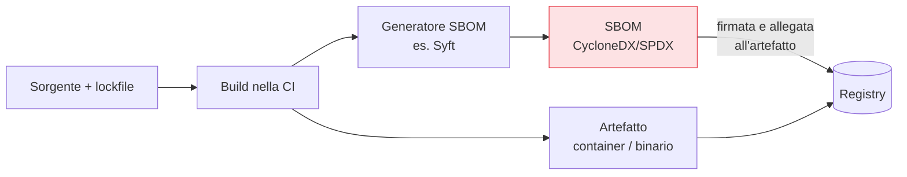

## Perché conta

Quando è uscito Log4Shell, la domanda che ha paralizzato migliaia di aziende non era "come si
corregge?" ma "**dove ce l'ho?**". Senza un inventario, rispondere ha richiesto settimane di caccia
manuale. La [SCA]() trova i CVE nelle dipendenze, ma presuppone
di sapere *cosa* gira in produzione. La **SBOM (Software Bill of Materials)** è quell'inventario: la
distinta base di ogni componente di ciò che spedisci.

## Cos'è, concretamente

Una SBOM è un documento strutturato e leggibile da una macchina che elenca, per ogni artefatto:

```text {hl_lines=[2,3]}
Per ogni componente:
  - nome e VERSIONE esatta        ← la chiave per matchare i CVE
  - identificatore univoco (PURL) ← pkg:npm/lodash@4.17.21
  - hash / checksum               ← integrità
  - licenza                       ← anche compliance legale
  - relazioni (chi dipende da chi)
```

Due standard dominano: **SPDX** (ISO, nato attorno alla compliance delle licenze) e **CycloneDX**
(OWASP, nato con la sicurezza in mente). Entrambi vanno bene; l'importante è generarla in un formato
standard, non in un foglio di calcolo fatto a mano.

## Dove e come generarla

La SBOM si genera **nella pipeline**, al momento della build, quando si conosce esattamente cosa
finisce nell'artefatto. Generarla dopo, a posteriori, significa indovinare.



Punto chiave: la SBOM va **allegata all'artefatto e firmata**, così viaggia con esso ed è
verificabile (lo vedremo con [Sigstore]()). Una SBOM
che vive in una cartella scollegata dall'artefatto che descrive perde metà del valore.

## Usarla davvero

Una SBOM archiviata e mai consultata è teatro della conformità. Il valore sta nell'uso:

- **Risposta ai CVE**: esce una vulnerabilità su `libxyz 1.4`? Una query sulle SBOM archiviate dice
  in minuti *quali* servizi la contengono. La caccia di Log4Shell diventa un filtro.
- **Policy di ingresso**: l'admission control può rifiutare un'immagine *senza* SBOM o con componenti
  vietati (licenze incompatibili, pacchetti in blocklist).
- **Monitoraggio continuo**: le SBOM si ri-scansionano contro i database aggiornati, così si scoprono
  CVE *nuovi* su software già in produzione da mesi.

## Il limite onesto: profondità

Una SBOM è buona quanto il generatore che la produce. Alcuni componenti sfuggono: binari statici,
dipendenze incluse a mano, codice generato. La SBOM non è una verità magica, è una *misura* della tua
visibilità — e il primo passo per migliorarla è vedere dove è incompleta.


<details>
<summary><strong>Domanda:</strong> se la SCA già scansiona le dipendenze e trova i CVE, perché serve anche produrre e archiviare una SBOM? Non è informazione duplicata?</summary>
<p>Si sovrappongono sull'input — entrambe partono dall'elenco dei componenti — ma rispondono a due domande
diverse in due momenti diversi, e averne una sola lascia scoperto l'altro. La SCA è un'analisi che fai
<em>ora</em>, nella pipeline, e ti dice "questo artefatto, oggi, contiene questi CVE noti": è puntuale e
legata al momento della build. La SBOM è un <em>inventario persistente e interrogabile</em> che
sopravvive alla build e viaggia con l'artefatto in produzione. La differenza si vede nel caso che conta di
più: un CVE che <em>non esisteva</em> quando hai fatto la build. La SCA di allora non poteva trovarlo,
perché il database non lo conosceva ancora. Sei mesi dopo esce il nuovo Log4Shell: con la sola SCA dovresti
ricostruire o re-scansionare ogni artefatto per sapere chi è colpito, ammesso di sapere ancora
esattamente cosa gira dove. Con le SBOM archiviate e indicizzate, invece, fai una query — "chi contiene
libxyz sotto la 1.5?" — e hai la lista in minuti, senza toccare le build. In più la SBOM serve a cose che
la SCA non copre: la verifica all'ingresso (l'admission control rifiuta ciò che non ha una SBOM o ha
componenti vietati), la conformità delle licenze, e la provenienza. Il modo giusto di vederle: la SCA è
l'<em>azione</em> di cercare vulnerabilità, la SBOM è il <em>dato</em> che rende quella ricerca possibile
per sempre, anche sui CVE che non erano ancora stati scoperti. Si alimentano a vicenda.</p>
</details>


## Conclusione

La SBOM è la distinta base del software: sai cosa spedisci, quindi sai in minuti se un nuovo CVE ti
riguarda. Si genera nella build, si firma, viaggia con l'artefatto e si interroga nel tempo. Ma sapere
*cosa* c'è dentro un artefatto non basta se non possiamo fidarci di *come* è stato costruito. Un
attaccante che compromette la pipeline può iniettare codice senza toccare il sorgente. Difendere la
catena di costruzione è il prossimo tema: SLSA, prossimo capitolo.
