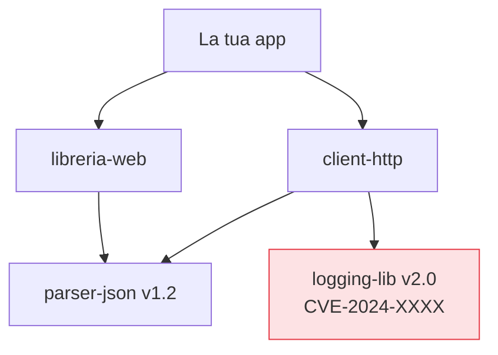

## Perché conta

Il [SAST]() analizza il codice che scriviamo. Ma in
un'applicazione moderna quel codice è una frazione del totale: il resto sono **dipendenze** — librerie
open source, transitivamente centinaia di pacchetti che non abbiamo mai letto. La **SCA (Software
Composition Analysis)** si occupa di questo codice: trova le vulnerabilità *note* (CVE) nelle librerie
che importiamo. Log4Shell ci ha insegnato quanto possa pesare una sola riga in un `pom.xml`.

## L'albero delle dipendenze transitive

Il punto chiave: non si importano le librerie dichiarate, si importa il loro intero albero.



Hai dichiarato `client-http`, ma ti ritrovi `logging-lib v2.0` vulnerabile *senza averla mai scritta*
nel tuo manifest. La SCA risolve l'intero albero e confronta ogni nodo con i database di
vulnerabilità. La maggior parte dei CVE che ti colpiscono vive nelle dipendenze **transitive**, quelle
che non hai scelto consapevolmente.

## Non tutti i CVE ti riguardano

Il tranello della SCA è il diluvio di avvisi. Un CVE in una libreria *non significa* che la tua app
sia vulnerabile. Due domande filtrano il rumore:

```text {hl_lines=[2,3]}
Per ogni CVE segnalato:
  1. Uso davvero la funzione vulnerabile?   (reachability)
  2. Il percorso è esposto a input ostile?  (exploitability nel mio contesto)
Se entrambe NO → rischio basso, patch pianificata, non emergenza.
```

Gli strumenti più avanzati fanno **reachability analysis**: controllano se il tuo codice chiama
davvero la funzione vulnerabile. Un CVE in un metodo che non invochi mai è rumore a bassa priorità;
uno nel percorso di autenticazione esposto a internet è un'emergenza. Prioritizzare per contesto, non
per numero di avvisi, è ciò che tiene il team sano — lo vedremo meglio nel capitolo sul
[vulnerability management]().

## Aggiornare senza rompere

La SCA non serve a nulla se poi non si aggiorna. Le pratiche che funzionano:

- **Bot di aggiornamento** (Dependabot, Renovate) che aprono pull request automatiche per le nuove
  versioni, testate dalla CI.
- **Lockfile** committati: la build è riproducibile, si sa esattamente quale versione gira.
- **Aggiornamenti piccoli e frequenti** invece del salto di tre major ogni due anni, che nessuno osa
  fare perché romperebbe tutto.

## Nel flusso di lavoro

La SCA sta nella CI (su ogni pull request, analizzando il manifest e il lockfile) e come scansione
periodica del codice già in produzione: un CVE nuovo può emergere su una dipendenza che non tocchi da
mesi. Questo richiede di sapere *cosa* gira davvero in produzione — l'inventario degli artefatti, che
è il tema della SBOM, tra pochi capitoli.


<details>
<summary><strong>Domanda:</strong> se continuo ad aggiornare le dipendenze a ogni CVE, non introduco instabilità e rischio di supply chain (una versione nuova compromessa) peggiore del CVE stesso?</summary>
<p>È una tensione reale e va gestita, non ignorata in nessuna delle due direzioni. Aggiornare alla cieca
a ogni avviso è sbagliato quanto non aggiornare mai: una nuova versione può introdurre regressioni, o —
caso raro ma grave — essere una release compromessa, come negli attacchi di supply chain dove l'account
di un maintainer viene violato. La risposta non è scegliere tra "sempre" e "mai", è <em>prioritizzare e
verificare</em>. Prioritizzare: non tutti i CVE sono emergenze, la reachability analysis e il contesto
dicono quali patchare subito e quali possono attendere una finestra pianificata, così non sei in
aggiornamento perpetuo. Verificare: l'aggiornamento passa dalla CI con i tuoi test, non va dritto in
produzione; aggiorni a versioni che hanno qualche giorno di vita, non all'ora zero; usi il lockfile con
gli hash così sai che stai scaricando esattamente l'artefatto atteso; e, per i rischi di supply chain
veri, ti appoggi alla verifica della provenienza e delle firme (SLSA, Sigstore — i prossimi capitoli)
invece di fidarti del solo numero di versione. Il rischio di una dipendenza vulnerabile nota, con exploit
pubblico, è quasi sempre più alto e più certo del rischio ipotetico di una release compromessa che i
controlli di provenienza intercettano. Aggiornare in modo disciplinato riduce entrambi; non aggiornare
ne elimina uno solo e ti lascia l'altro, che è anche il più sfruttato.</p>
</details>


## Conclusione

La SCA illumina il codice che non hai scritto: risolve l'albero transitivo, trova i CVE noti e — se
fatta bene — li prioritizza per reachability invece che per conteggio. Insieme al SAST copre il
codice, nostro e altrui, in modo statico. Ma entrambi guardano il codice *fermo*. Alcuni difetti si
vedono solo quando l'applicazione gira e risponde a richieste reali: è il turno dell'analisi dinamica,
prossimo capitolo.
