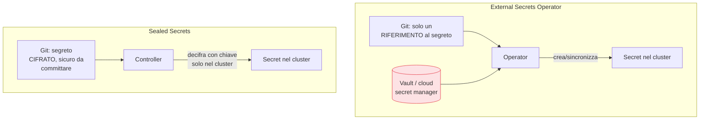

## Perché conta

Abbiamo imparato a non mettere mai i [segreti nel codice]().
Nel cluster il problema torna con una trappola specifica: i **Secret di Kubernetes sono codificati in
base64, non cifrati**. Chiunque legga l'oggetto Secret, o acceda a etcd, li legge in chiaro con un
comando. Sono comodi per *consegnare* un segreto a un pod, ma pessimi come *deposito*. Questo capitolo
è come usarli bene senza illudersi.

## base64 non è cifratura

```text {hl_lines=[3]}
kubectl get secret db-pass -o jsonpath='{.data.password}' | base64 -d
# → stampa la password in chiaro.
# base64 è una CODIFICA, non una protezione: reversibile da chiunque, senza chiave.
```

Due conseguenze immediate: **cifrare etcd a riposo** (encryption-at-rest, idealmente con un KMS
esterno) perché altrimenti chi copia etcd ha tutti i segreti; e **restringere con RBAC** chi può
leggere i Secret, perché il permesso `get secrets` equivale ad avere quei segreti.

## Il problema del GitOps

Il GitOps vuole *tutto* in git, inclusa la configurazione dei Secret. Ma committare un Secret, anche
base64, è committare il segreto in chiaro nella history. Due soluzioni opposte:



- **External Secrets Operator**: la fonte di verità resta un [vault esterno]();
  in git c'è solo un *riferimento*. L'operator sincronizza. Il segreto non tocca mai git.
- **Sealed Secrets**: il segreto si *cifra* con una chiave pubblica; la cifratura è sicura da
  committare perché solo il controller nel cluster ha la chiave privata per decifrarla.

## Montare senza esporre

Il modo in cui il segreto arriva al container conta. Le variabili d'ambiente sono comode ma trapelano
facilmente (compaiono nei dump, nei log di errore, nell'introspezione del processo). Montare i segreti
come **file** è più sicuro, e i **CSI Secrets Store driver** fanno un passo oltre: montano il segreto
dal vault esterno direttamente nel filesystem del pod a runtime, senza nemmeno creare un oggetto
Secret persistente. Il segreto esiste solo finché il pod vive.

## Rotazione e vita breve

Vale qui ciò che valeva per i segreti applicativi: meglio **dinamici e a vita breve** che statici e
rotati a mano. L'External Secrets Operator può ri-sincronizzare periodicamente; i vault possono
emettere credenziali effimere. E l'approdo naturale è non consegnare affatto un segreto condiviso, ma
dare a ogni workload una *identità* da cui derivare le credenziali — il tema del prossimo capitolo.


<details>
<summary><strong>Domanda:</strong> se cifro etcd a riposo e restringo l'RBAC, i Secret nativi di Kubernetes non sono già abbastanza sicuri? Perché aggiungere la complessità di vault esterni e operator?</summary>
<p>Cifrare etcd e stringere l'RBAC sono necessari e vanno fatti comunque, ma risolvono solo una parte del
problema, e la parte che lasciano aperta è spesso quella dove i segreti trapelano davvero. Cosa coprono:
chi ruba una copia di etcd non legge i segreti (cifratura a riposo), e chi non ha i permessi non può fare
<code>get secrets</code> (RBAC). Cosa <em>non</em> coprono: primo, il ciclo di vita. Un Secret nativo è
statico — lo crei una volta e resta lì finché qualcuno lo ruota a mano, cosa che in pratica non succede
mai; non c'è rotazione automatica, non c'è scadenza, un segreto trapelato vale finché qualcuno non se ne
accorge. Un vault esterno offre credenziali dinamiche a vita breve, così il valore di un furto crolla.
Secondo, il perimetro di fiducia. Con i Secret nativi, la tua sorgente di verità per i segreti è il
cluster stesso: chiunque comprometta il cluster — o un suo amministratore — ha tutti i segreti. Con un
vault esterno il cluster è solo un consumatore, il vault applica le proprie policy di accesso e audit, e
puoi revocare l'accesso del cluster senza toccare i segreti. Terzo, la frammentazione. Senza un vault,
ogni cluster ha i suoi Secret scollegati; con un vault hai una gestione centralizzata, un audit unico di
chi ha letto cosa, e la stessa credenziale non duplicata in dieci posti. Quarto, il GitOps: i Secret
nativi ti costringono a scegliere tra non mettere i segreti in git (e perdere la riproducibilità) o
committarli in base64 (e bruciarli); External Secrets e Sealed Secrets risolvono esattamente questo. Non
sto dicendo che ti serva sempre tutto l'armamentario: per un cluster piccolo, Secret nativi + etcd
cifrato + RBAC stretto sono un punto di partenza onesto. Ma la complessità del vault non è gratuita per
capriccio: compra rotazione, vita breve, centralizzazione e audit — cioè proprio le proprietà che
trasformano "il segreto è protetto se nessuno sbaglia" in "il segreto vale poco anche se qualcosa va
storto". La domanda da farsi è quanto vale ciò che quei segreti proteggono.</p>
</details>


## Conclusione

I Secret di Kubernetes sono un meccanismo di consegna, non una cassaforte: base64 non è cifratura,
quindi servono etcd cifrato e RBAC stretto, e per il GitOps o un vault esterno (External Secrets) o la
cifratura (Sealed Secrets), montando a runtime via CSI quando possibile. Il passo successivo è smettere
di consegnare segreti condivisi e dare a ogni workload la propria identità verificabile, da cui tutto
il resto deriva. È l'identità dei workload nella pipeline e nel cluster, prossimo capitolo.
