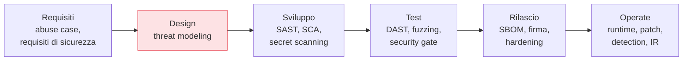

## Perché conta

Nel capitolo precedente abbiamo stabilito il *perché* dello [shift left]().
Ora il *dove*: quali attività di sicurezza appartengono a quale fase. Senza una cornice, ogni team
reinventa un insieme casuale di controlli, dimentica interi domini (la gestione dei segreti, la
supply chain) e non sa dire se sta migliorando. Il **Secure SDLC** è quella cornice.

## Le fasi e i loro controlli



Ogni fase ha un controllo *naturale*: il momento in cui quel tipo di difetto è più economico da
prevenire. Mettere il threat modeling nel design evita di scrivere codice su un'architettura
sbagliata; mettere il SAST nello sviluppo cattura i bug mentre il contesto è fresco nella mente di
chi li ha scritti.

## Due framework da conoscere

- **NIST SSDF (SP 800-218)**: descrive *pratiche* in quattro gruppi — preparare l'organizzazione,
  proteggere il software, produrre software ben protetto, rispondere alle vulnerabilità. È
  prescrittivo sul *cosa*, agnostico sul *come*. Ottimo come checklist di copertura.
- **OWASP SAMM**: un *modello di maturità*. Non chiede solo "lo fai?" ma "a che livello?" (1, 2, 3)
  su quindici pratiche. Serve a misurare dove sei e dove andare, non a fare tutto subito.

## Maturità, non perfezione

L'errore classico è voler implementare ogni controllo al massimo livello dal primo giorno. Risultato:
pipeline lentissime, team in rivolta, controlli disattivati. La maturità è un percorso:

```text {hl_lines=[2]}
Livello 1  controllo implementato, anche solo su progetti pilota   ← comincia qui
Livello 2  applicato in modo coerente, con processo definito
Livello 3  misurato, ottimizzato, automatizzato ovunque
```

Si sceglie *per rischio*: i servizi esposti a internet e che toccano dati sensibili salgono di
livello prima di un tool interno letto da tre persone. Una cornice serve a prioritizzare, non a
pretendere uniformità.

## Il SDLC incontra il CI/CD

Il Secure SDLC è il *cosa*; la pipeline CI/CD è il *dove lo automatizzi*. Ogni controllo della
catena ha una collocazione naturale nella pipeline: il secret scanning come hook di pre-commit, il
SAST sulla pull request, il DAST in staging, la firma dell'artefatto al rilascio. I capitoli
successivi riempiono ogni casella; questa è la mappa che impedisce di dimenticarne una.


<details>
<summary><strong>Domanda:</strong> i framework come SSDF e SAMM non sono solo burocrazia che rallenta un team agile?</summary>
<p>Diventano burocrazia solo se usati male — come moduli da compilare per un auditor invece che come
checklist per non dimenticare domini interi. Usati bene fanno l'opposto di rallentare: evitano la
retromarcia costosa. Il team agile che salta il threat modeling e scopre a sei mesi dal lancio che
l'architettura di multi-tenancy perde dati tra clienti non è stato veloce, è stato veloce verso un muro.
Il valore di una cornice non è la cerimonia, è la <em>copertura</em>: senza, è statisticamente certo che
dimenticherai qualcosa — di solito la gestione dei segreti o la supply chain, i due domini che nessuno
"sente" come proprio finché non esplodono. Il modo agile di usare questi framework è prenderli come menu,
non come contratto: scegli i controlli proporzionati al rischio del servizio, li automatizzi nella
pipeline così non pesano sul lavoro quotidiano, e sali di maturità quando il rischio lo giustifica. La
cornice è leggera; è l'incidente che evita a essere pesante.</p>
</details>


## Conclusione

Il Secure SDLC mappa un controllo a ogni fase, e i modelli di maturità trasformano "fai tutto" in un
percorso guidato dal rischio. È la mappa; il resto della serie sono le tappe. La prima, e quella con
il miglior rapporto costo/beneficio, vive nel design: ragionare da attaccante *prima* di scrivere
codice. È il threat modeling, prossimo capitolo.
