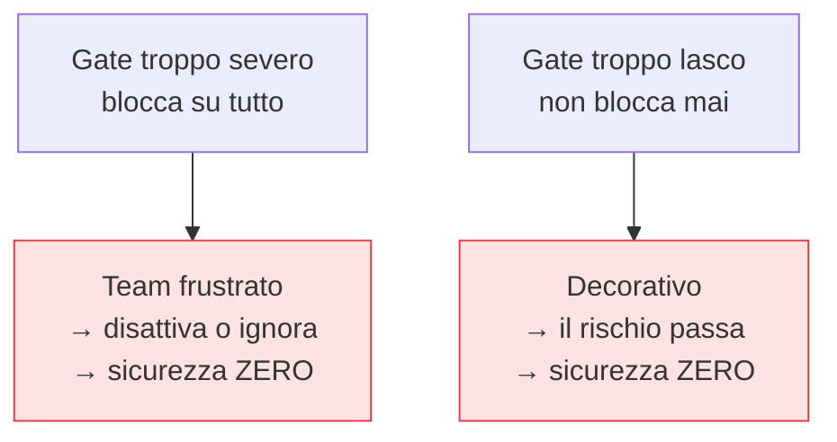

## Perché conta

Tutti i controlli della serie — [SAST](),
[SCA](), [scanning immagini](),
[policy]() — a un certo punto devono decidere: *fermo o
no questa build?* Quella decisione è il **security gate**. Ed è il punto dove DevSecOps vive o muore
nella pratica: un gate progettato male non rende sicuri, rende *lenti*, e un team rallentato trova il
modo di disattivarlo. L'obiettivo è un cancello che il team *non voglia* aggirare.

## I due fallimenti simmetrici



Entrambi gli estremi portano allo stesso posto: zero sicurezza effettiva. Il gate utile vive nel
mezzo, e ci sta grazie a tre principi.

## 1. Baseline: blocca il nuovo, non il vecchio

Un repository esistente ha un *debito* di problemi preesistenti. Un gate che pretende di azzerarlo
prima di accettare qualsiasi commit blocca tutto il lavoro: inaccettabile. La **baseline** separa il
debito dalla regressione:

```text {hl_lines=[3]}
Problemi esistenti (baseline)  →  tracciati, pianificati, NON bloccano
Problemi NUOVI introdotti dalla PR  →  BLOCCANO
# risultato: non peggiori mai, e riduci il debito quando puoi, senza fermare tutto
```

Così il gate garantisce che la situazione non peggiori a ogni commit, mentre il debito si riduce in
modo pianificato, non in un big-bang che paralizza.

## 2. Severità e contesto, non conteggio

Bloccare su "qualunque finding" produce rumore e aggiramento. Si blocca su ciò che conta: severità
**alta/critica**, raggiungibile, su servizi esposti. La soglia va tarata sul rischio del servizio —
un servizio internet-facing che tratta dati sensibili ha un gate più stretto di un tool interno. Il
[vulnerability management]() dà i criteri per
decidere cosa è "alto" davvero.

## 3. Eccezioni tracciate, non aggiramenti nascosti

A volte bisogna rilasciare *nonostante* un finding: un falso positivo, un rischio accettato
consapevolmente, un'urgenza. Se l'unico modo è disattivare il gate, prima o poi resta disattivato. Il
gate maturo offre una **via di eccezione esplicita**: si marca il finding come accettato, con un
responsabile, una motivazione e una scadenza, e resta *tracciato*. La differenza tra un'eccezione
tracciata e un aggiramento nascosto è tutta: la prima è una decisione di rischio visibile e
revisionabile, la seconda è un buco che nessuno ricorda.

## Fail closed o fail open?

Cosa succede se il *controllo stesso* fallisce (lo scanner va in errore, il servizio di policy è
giù)? Per i controlli di sicurezza critici, **fail closed** (blocca) è il default prudente: meglio
una build ferma che un'immagine non verificata in produzione. Per i controlli informativi,
**fail open** (passa con warning) evita che un problema infrastrutturale blocchi tutta la consegna.
La scelta va fatta *consapevolmente* per ogni gate, non subita come comportamento accidentale dello
strumento.


<details>
<summary><strong>Domanda:</strong> la via di eccezione tracciata non diventa inevitabilmente la scorciatoia che tutti usano per far passare qualsiasi cosa, svuotando il gate dall'interno?</summary>
<p>Può diventarlo, ma solo se la progetti come un timbro invece che come una decisione — e la differenza
sta in quattro dettagli concreti. Primo, l'eccezione deve costare <em>abbastanza</em> da non essere la via
di minor resistenza: richiede un'approvazione di qualcuno diverso da chi la chiede (il principio dei
quattro occhi), una motivazione scritta che diventa un record, non un flag silenzioso in un file. Se
accettare un rischio è più scomodo che risolverlo per i casi facili, i casi facili si risolvono. Secondo,
l'eccezione deve <em>scadere</em>: non "accettato per sempre" ma "accettato fino al 30 del mese prossimo",
dopodiché il gate torna a bloccare. Questo impedisce al debito di eccezioni di accumularsi
silenziosamente — ogni eccezione è un impegno a tempo, non un condono. Terzo, le eccezioni devono essere
<em>visibili e misurate</em>: un cruscotto che mostra quante eccezioni attive ci sono, su quali servizi,
chi le ha approvate, quando scadono. Nel momento in cui le eccezioni diventano un numero che qualcuno
guarda — e un trend che cresce è un segnale d'allarme discusso nelle metriche di sicurezza — smettono di
essere invisibili e quindi di essere abusate. Quarto, va distinta l'eccezione (rischio accettato
consapevolmente) dalla soppressione del falso positivo (il finding non è reale): la seconda migliora la
taratura dello strumento ed è sana, la prima è una decisione di rischio che va pesata. Il punto di fondo:
la via di eccezione non è una debolezza del gate, è ciò che lo rende <em>sostenibile</em> e quindi
mantenuto. Un gate senza via di uscita viene disattivato alla prima emergenza legittima, e una volta
disattivato protegge zero. Un gate con eccezioni tracciate, approvate, a scadenza e misurate rimane
acceso, e il rischio residuo è <em>noto e gestito</em> invece che nascosto. Preferisci cento eccezioni
che puoi contare e far scadere, o un gate spento di cui nessuno parla più?</p>
</details>


## Conclusione

Il security gate utile è un equilibrio: blocca il nuovo rischio alto grazie alla baseline, decide per
severità e contesto invece che per conteggio, offre eccezioni tracciate invece di aggiramenti, e
sceglie fail-closed o fail-open consapevolmente. Un gate che il team vuole tenere acceso vale più di
uno perfetto che viene disattivato. Ma "rischio alto" finora è stato un'etichetta: come si misura e si
confronta davvero una vulnerabilità contro le altre? È il vulnerability management, prossimo capitolo.
