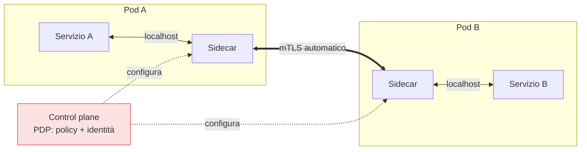

## Perché conta

I capitoli 11 e 12 hanno dato ai servizi un'[identità]() e un
modo per autenticarsi con [mTLS](). Ma chiedere a
**ogni** servizio di implementare mTLS, rotazione dei certificati, policy e telemetria nel proprio
codice è irrealistico: ogni team lo farebbe in modo diverso, e metà lo farebbe male. Il **service
mesh** risolve spostando tutta questa logica fuori dall'applicazione, in un **sidecar**: lo Zero
Trust tra servizi diventa infrastruttura, trasparente al codice.

## L'idea: il sidecar

In un service mesh, accanto a ogni servizio gira un **proxy sidecar** (es. Envoy) che intercetta
tutto il traffico in entrata e in uscita. Il servizio crede di parlare in chiaro con `localhost`; è
il sidecar a stabilire mTLS, applicare le policy e raccogliere le metriche.



Il **control plane** del mesh è il [PDP]():
distribuisce identità e policy. I **sidecar** sono i [PEP]():
applicano a ogni connessione. È lo schema Zero Trust, realizzato senza toccare il codice dei servizi.

## Cosa dà al modello Zero Trust

- **mTLS automatico e universale**: il mesh emette, distribuisce e ruota i certificati (spesso basati
  su SPIFFE) e cifra tutto il traffico est-ovest senza che gli sviluppatori facciano nulla. Il "costo
  dei certificati" del capitolo mTLS sparisce nell'infrastruttura.
- **Autorizzazione per identità**: policy come "il servizio *ordini* può chiamare *pagamenti* solo
  sulla rotta `/charge`" si scrivono nel control plane e valgono per tutte le istanze.
- **Osservabilità uniforme**: ogni sidecar produce metriche, log e tracce coerenti, alimentando la
  [telemetria]() necessaria alla verifica
  continua.

```yaml {hl_lines=[7,8,9,10]}
# Istio AuthorizationPolicy: pagamenti accetta solo da 'ordini', solo POST /charge
apiVersion: security.istio.io/v1
kind: AuthorizationPolicy
metadata: { name: pagamenti-allow-ordini }
spec:
  selector: { matchLabels: { app: pagamenti } }
  rules:
    - from: [{ source: { principals: ["spiffe://azienda/ns/ordini/sa/ordini"] } }]
      to:   [{ operation: { methods: ["POST"], paths: ["/charge"] } }]
```

Le righe evidenziate sono una policy Zero Trust completa tra servizi: **chi** (identità SPIFFE di
*ordini*), **cosa** (POST su `/charge`), tutto il resto negato.

## Il prezzo: complessità

Il service mesh non è gratis. Aggiunge un proxy per ogni pod (risorse, latenza), un control plane da
gestire, e una curva di apprendimento ripida. Per poche manciate di servizi può essere più peso che
beneficio. Le alternative emergenti basate su [eBPF]()
(es. Cilium) spostano parte del lavoro nel kernel, riducendo l'overhead dei sidecar. La scelta
dipende dalla scala: il mesh conviene quando i servizi sono tanti e la gestione manuale di mTLS e
policy è già un problema.

## Lab

In un cluster di test con Linkerd (più semplice) o Istio:

1. Installate il mesh e iniettate i sidecar in due servizi di test.
2. Verificate che il traffico tra loro sia **automaticamente** in mTLS (ispezionate i certificati o
   le metriche del mesh), senza aver toccato il codice.
3. Applicate una policy di autorizzazione che consenta solo una rotta da un solo servizio di origine.
4. Provate una chiamata non autorizzata e osservatela bloccata dal sidecar.


<details>
<summary><strong>Domanda:</strong> il service mesh fa le stesse cose della microsegmentazione e dello ZTNA; non è ridondanza?</summary>
<p>Si sovrappongono in parte, ma operano a livelli diversi e complementari. La
<a href="/p/microsegmentazione-nello-zero-trust/">microsegmentazione</a> di rete (NetworkPolicy, livello
3/4) decide <em>se</em> due workload possono scambiarsi pacchetti: è un controllo grossolano e robusto,
indipendente dall'applicazione. Il service mesh lavora al livello 7 e decide <em>cosa</em> può fare una
connessione già permessa: quale metodo HTTP, quale percorso, con quale identità provata da mTLS — più
cifratura e telemetria uniformi. Lo <a href="/p/ztna-oltre-la-vpn/">ZTNA</a>, ancora diverso, governa
l'accesso nord-sud degli <em>utenti</em> alle applicazioni. Difesa in profondità: la NetworkPolicy è il
muro grezzo, il mesh è il controllo fine sul traffico ammesso, lo ZTNA è la porta per gli utenti. Usarli
insieme non è ridondanza, è applicare lo stesso principio — verificare ogni accesso — a granularità e
direzioni diverse. La ridondanza vera sarebbe affidarsi a uno solo e sperare che copra tutto.</p>
</details>


## Conclusione

Il service mesh sposta mTLS, autorizzazione per identità e telemetria dal codice dei servizi a un
sidecar governato da un control plane: il PDP/PEP dello Zero Trust tra servizi, trasparente agli
sviluppatori. Il prezzo è la complessità, giustificata dalla scala. Finora le policy le abbiamo
descritte a parole; il prossimo capitolo le rende codice versionato e verificabile con OPA.
