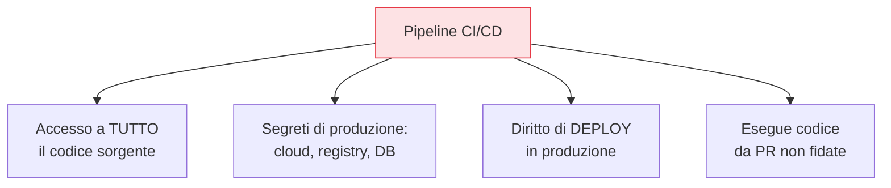

## Perché conta

[SLSA]() e [Sigstore]()
rendono la build verificabile, ma restano un presupposto: che la pipeline stessa non sia già
compromessa. Ed è un bersaglio ideale. La CI/CD legge il codice sorgente, custodisce i segreti di
produzione, e ha il diritto di **deployare**. Chi controlla la pipeline non ha bisogno di bucare la
produzione: ci arriva passando dalla porta principale. Eppure è spesso l'ambiente meno indurito di
tutti.

## Perché è un bersaglio così ricco



Un solo ambiente concentra accesso al codice, segreti potenti e privilegi di deploy. E in più esegue
codice fornito da altri: un contributo esterno, una dipendenza di build, uno script in un workflow.
Questa combinazione — alti privilegi *ed* esecuzione di codice non fidato — è esattamente ciò che si
evita in ogni altro sistema.

## I controlli che contano

### 1. Runner effimeri

Un runner persistente accumula stato tra una build e l'altra: segreti in cache, file lasciati,
processi. Un job malevolo può lasciare una backdoor che colpisce i job successivi. I **runner
effimeri** nascono puliti per ogni job e muoiono subito dopo: niente stato da avvelenare. È anche un
requisito per i livelli alti di SLSA.

### 2. Minimo privilegio dei token

Il token di un job dovrebbe potere *esattamente* ciò che serve a quel job e nulla più:

```yaml {hl_lines=[3,4]}
# GitHub Actions: permessi espliciti e minimi per job
permissions:
  contents: read      # legge il codice, non lo scrive
  id-token: write     # per OIDC (firma / deploy), niente segreti statici
# tutto il resto: negato di default
```

Il default di molte pipeline è l'opposto: un token onnipotente usato da ogni job. Restringere per job
limita il danno di un singolo step compromesso.

### 3. OIDC invece di chiavi statiche

Mettere le chiavi cloud di lungo termine nei secret della CI è un rischio permanente. Con **OIDC** la
pipeline prova la propria identità al cloud provider e riceve credenziali *temporanee* per quel job:
niente chiave statica da rubare, stesso principio della firma keyless di Sigstore.

### 4. Difesa dai workflow da PR non fidate

Le pull request da fork sono codice ostile potenziale. Regole essenziali: non dare i segreti ai
workflow innescati da PR esterne, richiedere l'approvazione manuale prima di eseguirli, e **fissare le
action a un hash** (`uses: actions/checkout@<sha>`), non a un tag mutabile che un attaccante potrebbe
spostare.

## La disciplina delle action di terze parti

Ogni `uses:` nella pipeline è codice di terzi con l'accesso del job. Un tag come `@v3` può essere
ri-puntato dall'autore (o da chi lo compromette) a codice diverso. Fissare all'hash del commit rende
immutabile ciò che gira, e va trattato come una dipendenza qualsiasi: inventariato, aggiornato con
giudizio, verificato.


<details>
<summary><strong>Domanda:</strong> fissare ogni action a un hash e dare permessi minimi a ogni job sembra tanta frizione; con decine di repository, non diventa ingestibile?</summary>
<p>La frizione è reale ma è un costo di configurazione una tantum, mentre il rischio che elimina è
permanente e si realizza nel modo peggiore — e la soluzione alla scala non è rinunciarvi, è
automatizzarlo. Prendi il pinning all'hash: sì, un tag è più comodo di uno sha, ma un tag è
<em>mutabile</em>, e la storia recente è piena di action e pacchetti il cui tag è stato ripuntato a codice
malevolo dopo che migliaia di pipeline lo usavano già — con l'accesso completo del job, inclusi i segreti.
Il pinning trasforma "eseguo qualunque cosa ci sia dietro v3 oggi" in "eseguo esattamente questo commit
che ho verificato". Alla scala di decine di repo non lo fai a mano: lo fai con gli stessi strumenti che
già usi per le dipendenze — Renovate o Dependabot aggiornano gli hash con pull request testate, esattamente
come fanno con le librerie, così resti aggiornato senza fidarti ciecamente di un tag. Lo stesso per i
permessi minimi: non li scrivi repo per repo, li imponi con una policy organizzativa — permessi di default
a sola lettura a livello di org, template di workflow condivisi, e un controllo in pipeline (anche OPA)
che segnala i job con permessi eccessivi. Il punto è che la pipeline è l'ambiente a più alto privilegio
che hai: concentra codice, segreti e diritto di deploy. È esattamente il posto dove la frizione di
configurazione è giustificata, perché un singolo step compromesso qui non è un bug in un servizio, è
l'accesso a tutti i servizi. La domanda da ribaltare è: con decine di repository che possono deployare in
produzione, puoi permetterti che <em>non</em> siano induriti?</p>
</details>


## Conclusione

La pipeline concentra codice, segreti e diritto di deploy, ed esegue codice non fidato: va trattata
come l'ambiente più critico, non il più trascurato. Runner effimeri, token a privilegio minimo, OIDC
al posto delle chiavi statiche e action fissate all'hash sono i controlli base. Una classe di
protezione merita un capitolo a sé, perché gran parte dell'infrastruttura oggi nasce da codice:
l'Infrastructure as Code e i suoi rischi, prossimo capitolo.
