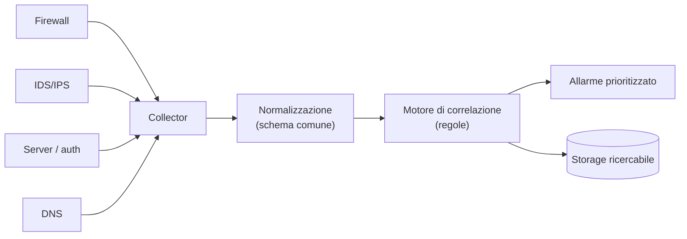

## Perché conta

Ogni componente di sicurezza vede un frammento. L'[IDS Suricata]()
vede un pacchetto sospetto; il [firewall]() vede una
connessione bloccata; il server vede un login fallito; il DNS vede una query strana. Preso da solo,
ogni evento è rumore. L'attacco reale vive **nella relazione** tra questi frammenti: un login da un
paese insolito, *seguito* da una connessione verso un host mai visto, *seguita* da un trasferimento
dati anomalo. Il SIEM (Security Information and Event Management) è il punto dove tutti i log
confluiscono, vengono resi comparabili, e correlati in storie che un essere umano può leggere.

## Le tre fasi: raccogliere, normalizzare, correlare



- **Raccogliere**: convogliare log eterogenei (syslog, JSON, eventi Windows) in un punto unico.
- **Normalizzare**: mappare campi diversi su uno **schema comune**. L'IP sorgente si chiama
  `src_ip` ovunque, non `source`, `client`, `ip.src` a seconda del prodotto. Senza questo passo, la
  correlazione è impossibile.
- **Correlare**: applicare regole che legano eventi di sorgenti diverse nel tempo.

La normalizzazione è la fase meno vistosa e la più importante: è ciò che permette di chiedere "tutti
gli eventi da questo IP" e ottenere firewall, IDS e auth insieme.

## Perché la correlazione cambia tutto

Un singolo login fallito è normale. Cento login falliti su un account, *seguiti da uno riuscito*,
*seguito* da un accesso a dati sensibili, sono un attacco di brute force andato a segno. Nessuno dei
tre eventi, da solo, farebbe scattare nulla; la loro **sequenza** sì.

```text
regola: brute force riuscito
  QUANDO  >= 20 eventi "login fallito" (stesso account, finestra 5 min)
  SEGUITO DA  1 evento "login riuscito" (stesso account)
  ALLORA  allarme priorità ALTA, tecnica ATT&CK T1110
```

È la differenza tra guardare i pixel e vedere l'immagine. La correlazione temporale e per entità
(stesso utente, stesso host, stesso IP) è il cuore del valore di un SIEM.

## Scrivere detection: Sigma e ATT&CK

Le regole di detection si scrivono una volta e, idealmente, si eseguono su SIEM diversi. **Sigma** è
un formato aperto che descrive la logica in YAML, indipendente dal prodotto, e si **compila** verso
il linguaggio di query del SIEM specifico.

```yaml {hl_lines=[6,7,8,9]}
title: Login riuscito dopo molti fallimenti
logsource:
  category: authentication
detection:
  failures:
    event: login_failed
    count: '>=20'
  success:
    event: login_success
  timeframe: 5m
  condition: failures followed by success
level: high
tags:
  - attack.credential_access
  - attack.t1110        # Brute Force
```

Legare ogni regola a una tecnica **MITRE ATT&CK** (qui `T1110`) dà due vantaggi: un linguaggio
condiviso tra chi scrive e chi risponde, e una mappa della **copertura** — quali tecniche d'attacco
sapete rilevare e quali no.

## Il nemico vero: i falsi positivi

Un SIEM che grida a ogni evento diventa rumore che nessuno guarda — ed è così che gli attacchi reali
passano inosservati, sepolti sotto mille allarmi innocui. Il lavoro continuo di un SIEM non è
scrivere regole, ma **affinare** quelle che ci sono: ridurre i falsi positivi con contesto
(whitelist di host noti, soglie tarate sul traffico reale, arricchimento con threat intelligence).
Una regola che genera 500 allarmi al giorno, di cui 2 veri, è peggio di nessuna regola: addestra
l'analista a ignorarla.

## Lab

Con uno stack SIEM da laboratorio (Wazuh, o Elastic Security, o un semplice Loki/OpenSearch):

1. Convogliate i log di un firewall (nftables), di Suricata e dell'autenticazione (auth.log) in un
   collector unico.
2. Verificate la normalizzazione: cercate un IP e controllate di vedere eventi da tutte e tre le
   fonti con campi coerenti.
3. Scrivete una regola di correlazione "brute force riuscito" come sopra.
4. Simulate l'attacco (molti login falliti via Hydra in laboratorio, poi uno riuscito) e verificate
   che scatti **un solo** allarme correlato, non venti.


<details>
<summary><strong>Domanda:</strong> se ho già un IDS che genera allarmi, perché aggiungere un SIEM sopra?</summary>
<p>Perché l'IDS vede solo la rete, e solo un evento alla volta. Suricata vi dice "pacchetto sospetto
da X": non sa se quel pacchetto è arrivato <em>dopo</em> un login anomalo, né se lo stesso X sta anche
fallendo autenticazioni su un altro server. Il SIEM esiste proprio per unire la vista di rete
dell'IDS con quella di host, autenticazione e applicazioni, e per <em>mettere in relazione</em> eventi
che nessuna singola sonda può collegare. In più, concentra in un posto la ricerca forense ("cosa ha
fatto questo IP nelle ultime 24 ore, ovunque?") e la misura della copertura rispetto ad ATT&CK.
L'IDS è una sorgente eccellente <em>per</em> il SIEM, non un suo sostituto: uno vede i pacchetti,
l'altro vede la storia.</p>
</details>


## Conclusione

Un SIEM trasforma log sparsi e incomparabili in una vista unica e, soprattutto, correlata: è il
luogo dove i frammenti visti da IDS, firewall, server e DNS diventano la storia di un attacco. Le
tre fasi — raccogliere, normalizzare, correlare — culminano nel punto che conta: legare eventi
innocui in un allarme che ha senso. Il formato Sigma e la mappa ATT&CK rendono le detection
portabili e misurabili; e il lavoro infinito è tenere bassi i falsi positivi, perché un allarme
ignorato è peggio di nessun allarme.
