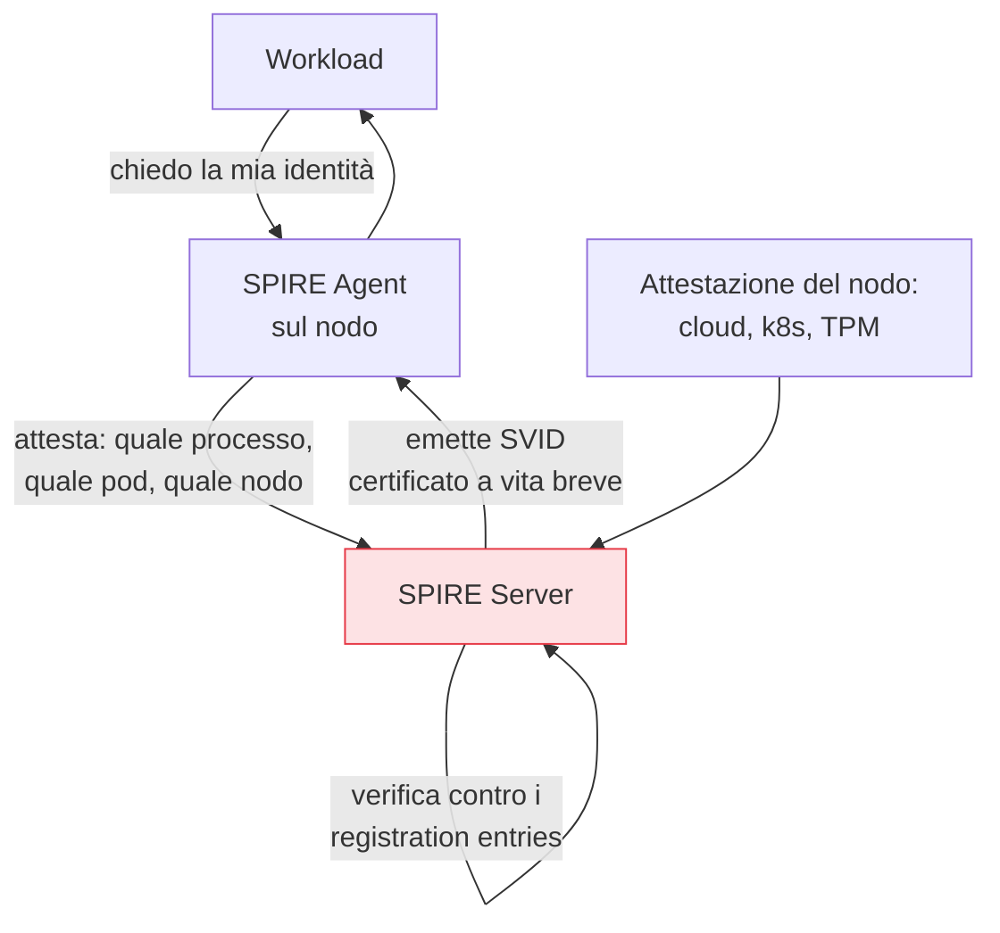

## Perché conta

Nel capitolo precedente abbiamo stabilito che ogni workload ha bisogno di un'identità crittografica
per l'[mTLS](). Ma sorge subito il problema più
difficile dell'intera identità macchina-a-macchina: il **bootstrap della fiducia**. Come fa un
servizio appena avviato a ottenere il suo primo certificato in modo sicuro, senza un segreto
pre-condiviso che a sua volta andrebbe protetto? SPIFFE e SPIRE risolvono proprio questo: uno
standardizza *cos'è* l'identità di un workload, l'altro la *emette* senza il problema dell'uovo e
della gallina.

## SPIFFE: lo standard dell'identità

**SPIFFE (Secure Production Identity Framework For Everyone)** definisce un formato universale per
l'identità di un workload: lo **SPIFFE ID**, un URI che descrive *chi* è il servizio,
indipendentemente da dove gira.

```text
spiffe://azienda.it/ns/pagamenti/sa/servizio-ordini
         └─ trust domain ─┘ └──── percorso del workload ────┘
```

Questa identità viene incapsulata in un documento verificabile, lo **SVID (SPIFFE Verifiable
Identity Document)**, tipicamente un **certificato X.509** (usabile direttamente in mTLS) o un JWT.
Il vantaggio dello standard: servizi, mesh e strumenti diversi parlano la stessa lingua di identità.

## SPIRE: emettere senza segreti pre-condivisi

**SPIRE** è l'implementazione che emette gli SVID. Il suo cuore è l'**attestazione**: invece di dare
a ogni servizio un segreto iniziale (che andrebbe custodito, diventando il nuovo bersaglio), SPIRE
**verifica proprietà osservabili** del workload e della piattaforma per decidere a chi dare quale
identità.



- **Node attestation**: SPIRE prova *su quale nodo* gira l'agent (identità del nodo cloud, token
  Kubernetes, TPM).
- **Workload attestation**: l'agent prova *quale processo/pod* sta chiedendo l'identità (selettori
  come lo UID del processo, le label del pod).

Il workload non presenta nessun segreto: è la piattaforma stessa a testimoniare chi è. Si àncora la
fiducia a proprietà verificabili, non a una chiave che qualcuno deve consegnare per primo.

## Il problema del bootstrap, risolto

```text {hl_lines=[3,4]}
# il nodo delle tartarughe: come si autentica il primo segreto?
API key / cert statico →  serve un segreto per ottenere il segreto (ricorsione)
SPIFFE/SPIRE          →  attestazione di proprietà della piattaforma
                         (nessun segreto iniziale da proteggere)
```

Questo è il contributo concettuale: eliminare il "segreto zero". La fiducia iniziale non poggia su
una credenziale consegnata, ma su ciò che la piattaforma può **attestare** del workload — lo stesso
principio dell'[attestazione del dispositivo]() via TPM,
applicato ai servizi.

## Rotazione automatica

Gli SVID hanno vita breve e SPIRE li **ruota** di continuo, trasparente al workload. Questo rende
pratico ciò che il capitolo mTLS richiedeva: certificati a vita breve senza gestione manuale. Un
SVID rubato vale per minuti, non per sempre.

## Lab

Con SPIRE in un cluster di test:

1. Avviate SPIRE Server e un SPIRE Agent su un nodo.
2. Create un *registration entry* che leghi uno SPIFFE ID a selettori di workload (es. una certa
   label di pod o UID).
3. Avviate un workload che combaci e verificate che riceva uno SVID (X.509) via l'API del Workload.
4. Usate due SVID per stabilire una connessione mTLS tra due servizi e osservate la rotazione
   automatica dei certificati.


<details>
<summary><strong>Domanda:</strong> l'attestazione si basa su selettori come "questo pod ha questa label"; chi impedisce a un attaccante di avviare un pod con la label giusta e rubare l'identità?</summary>
<p>È la domanda corretta, e la robustezza dell'attestazione sta nel <em>combinare</em> più selettori e
nel radicarli il più in basso possibile. Una sola label di pod sarebbe debole, esatto: chiunque possa
creare pod in quel namespace potrebbe imitarla. Per questo SPIRE compone l'attestazione del
<em>nodo</em> (provata da qualcosa che l'attaccante non falsifica: l'identità dell'istanza cloud, un
token del kubelet, un TPM) con quella del <em>workload</em> (selettori multipli: service account,
namespace, immagine, UID del processo). L'identità viene emessa solo se <em>tutti</em> combaciano, e
molti selettori dipendono da privilegi che l'attaccante non ha nel namespace giusto sul nodo giusto. La
sicurezza non è mai migliore della piattaforma sottostante — se qualcuno controlla l'orchestratore,
controlla le identità — ma questo riporta il problema al controllo d'accesso della piattaforma, dove
deve stare, invece di nasconderlo dietro un segreto pre-condiviso altrettanto rubabile. L'attestazione
sposta il bersaglio da "una stringa segreta" a "l'integrità della piattaforma", che è molto più difficile
da falsificare e molto più facile da monitorare.</p>
</details>


## Conclusione

SPIFFE dà un formato universale all'identità dei workload (lo SPIFFE ID, incapsulato in uno SVID);
SPIRE la emette tramite attestazione, eliminando il "segreto zero" e ruotando i certificati in
automatico. È l'infrastruttura che rende praticabile l'mTLS su scala. Ma chiedere a ogni servizio di
gestire SVID e mTLS nel proprio codice è troppo: serve uno strato che lo faccia per tutti. È il
service mesh, il prossimo capitolo.
