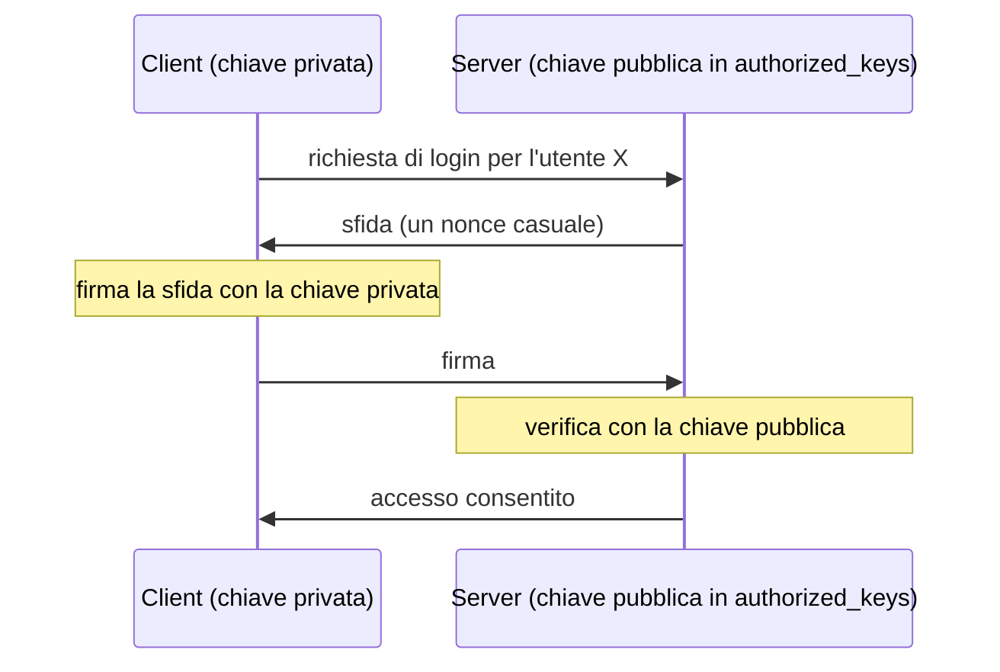

## Perché conta

SSH è il modo in cui si amministra praticamente ogni server Linux. È anche il primo servizio che
una botnet prova a forzare: su qualunque IP pubblico, i log mostrano migliaia di tentativi di
login al giorno. Un SSH mal configurato — password deboli, root abilitato, cifrari vecchi — è una
delle vie d'ingresso più comuni in assoluto. L'hardening di SSH è il singolo intervento con il
miglior rapporto tra sforzo e sicurezza guadagnata.

## Il modello: chiavi, non password

L'autenticazione a chiave pubblica sostituisce la password con una coppia crittografica. La chiave
privata resta sul client e non lascia mai la macchina; il server conserva solo la pubblica.



Una password può essere indovinata o intercettata; una chiave Ed25519 no, in pratica. E poiché il
server non riceve mai un segreto riutilizzabile, non c'è nulla da rubare dal lato server.

```bash
# generare una chiave moderna (Ed25519) sul client
ssh-keygen -t ed25519 -C "matteo@laptop"

# installarla sul server (aggiunge la pubblica ad authorized_keys)
ssh-copy-id -i ~/.ssh/id_ed25519.pub utente@server
```

## La configurazione del server

Il cuore dell'hardening è `/etc/ssh/sshd_config`. Le righe che contano:

```text {hl_lines=[2,3,4]}
# /etc/ssh/sshd_config
PasswordAuthentication no        # niente password: solo chiavi
PermitRootLogin no               # root non accede via SSH; si usa sudo
KbdInteractiveAuthentication no  # chiude anche la via interattiva/PAM alle password
PubkeyAuthentication yes
AllowUsers matteo                # solo questo utente può entrare
MaxAuthTries 3                   # pochi tentativi per connessione
LoginGraceTime 20                # finestra breve per autenticarsi
```

Le tre righe evidenziate sono le decisive: eliminano del tutto l'autenticazione a password, che è
il bersaglio del brute force. Con `PasswordAuthentication no`, i milioni di tentativi delle botnet
falliscono prima ancora di iniziare, perché il server non accetta quel metodo.

Dopo ogni modifica, validare e ricaricare:

```bash
sshd -t                  # verifica la sintassi: se sbagli, non ricaricare!
systemctl reload sshd
```

> Attenzione irreversibile: prima di impostare `PasswordAuthentication no`, verificate di poter
> entrare con la chiave in una **seconda** sessione già aperta. Un errore qui può chiudervi fuori
> dal server.

## Cifrari e algoritmi moderni

SSH negozia algoritmi di scambio chiavi, cifratura e MAC. Le versioni vecchie permettevano opzioni
oggi deboli. Si restringono alle moderne:

```text
KexAlgorithms curve25519-sha256,curve25519-sha256@libssh.org
Ciphers chacha20-poly1305@openssh.com,aes256-gcm@openssh.com
MACs hmac-sha2-512-etm@openssh.com,hmac-sha2-256-etm@openssh.com
```

I MAC in modalità *Encrypt-then-MAC* (`-etm`) sono preferibili. Queste liste tolgono dalla
negoziazione CBC, i MAC SHA-1 e lo scambio Diffie-Hellman su gruppi deboli.

## Ridurre la superficie

Oltre alla configurazione, due misure riducono l'esposizione:

- **Rate limiting / ban**: `fail2ban` o una regola nftables che limita le nuove connessioni alla
  porta 22. Non sostituisce le chiavi, ma riduce il rumore nei log.
- **Niente SSH su internet quando evitabile**: dietro una VPN (vedi
  [IPsec vs WireGuard]()) o con accesso limitato a IP noti.

```nftables
# limita i nuovi tentativi SSH a 10 al minuto per IP
table inet filter {
    chain input {
        tcp dport 22 ct state new meter ssh { ip saddr limit rate 10/minute } accept
        tcp dport 22 ct state new drop
    }
}
```

Spostare SSH su una porta diversa dalla 22 ("security through obscurity") riduce solo il rumore dei
log, non il rischio reale: non è hardening, è cosmesi.

## Lab

Su una VM o un container:

1. Generate una chiave Ed25519 e installatela sul server.
2. Verificate l'accesso con la chiave, poi impostate `PasswordAuthentication no` e ricaricate.
3. Da un altro terminale, provate a forzare la password (`ssh -o PubkeyAuthentication=no ...`):
   deve essere rifiutato.
4. Aggiungete la regola nftables e osservate i tentativi scartati.


<details>
<summary><strong>Domanda:</strong> se uso le chiavi, perché dovrei comunque disattivare la password invece di lasciarla come ripiego?</summary>
<p>Perché finché la password è accettata, la superficie d'attacco del brute force resta aperta, a
prescindere dal fatto che voi usiate le chiavi. Un attaccante non sa (e non gli importa) che voi
preferite le chiavi: tenterà comunque le password, e se un qualsiasi account del sistema ne ha una
debole, entra. Le chiavi come metodo aggiuntivo non proteggono: proteggono solo quando sono
l'<em>unico</em> metodo. Il "ripiego" a password è esattamente il buco che l'hardening chiude.</p>
</details>


## Conclusione

L'hardening di SSH si riduce a pochi principi: solo chiavi, niente root diretto, cifrari moderni,
superficie ridotta. La singola riga `PasswordAuthentication no` elimina da sola la categoria di
attacco più comune contro i server esposti. È cinque minuti di lavoro che chiude una delle porte
più battute di internet.
