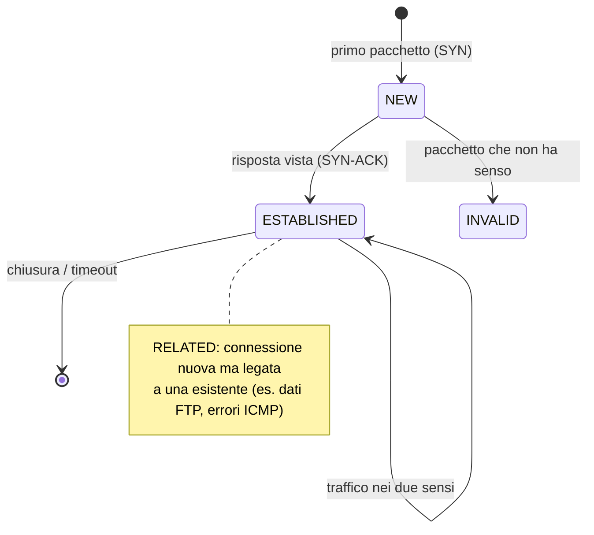

## Perché conta

Il [threat model]() ha prodotto regole come "dalla
DMZ nessuna connessione verso la LAN" (T5) e "la rete ospiti non raggiunge la LAN" (T1). Un
firewall è lo strumento che le mette in pratica. Ma un firewall scritto male è peggio di nessun
firewall: dà un falso senso di sicurezza. La differenza tra un firewall fragile e uno solido sta
in una parola: **stato**.

Su Linux lo strumento moderno è **nftables**, che dal 2014 sostituisce iptables. Qui vediamo
perché lo stato cambia tutto e come scrivere un ruleset leggibile.

## Stateless contro stateful

Un firewall **stateless** giudica ogni pacchetto da solo, senza memoria. Per permettere al PC
della LAN di navigare, deve consentire sia i pacchetti in uscita verso la porta 443, sia quelli
in ingresso dalla porta 443. Ma "permettere l'ingresso dalla 443" apre la porta a chiunque abbia
quella porta di origine: un attaccante la usa per entrare.

Un firewall **stateful** ricorda le connessioni aperte. Permette l'uscita, e lascia entrare
**solo** le risposte che appartengono a una connessione che l'host ha iniziato. Non serve nessuna
regola di ritorno. Su Linux questa memoria è **conntrack**, e ogni connessione attraversa stati
precisi:



La regola d'oro di ogni firewall stateful sta in una riga: **accetta ciò che è `established` o
`related`, scarta ciò che è `invalid`, e giudica con attenzione solo i pacchetti `new`**.

## Un ruleset nftables commentato

Questo è il firewall di un host o di un gateway. nftables usa un unico file, con una sintassi più
leggibile di iptables.

```nftables {hl_lines=[8,9,10,15]}
#!/usr/sbin/nft -f
flush ruleset

table inet filter {
    chain input {
        type filter hook input priority 0; policy drop;   # default: scarta tutto

        ct state established,related accept                 # le risposte alle connessioni aperte
        ct state invalid drop                               # pacchetti incoerenti: via subito
        iif lo accept                                       # il traffico di loopback è sempre ok

        ip protocol icmp icmp type echo-request limit rate 5/second accept
        tcp dport 22 ct state new accept                    # SSH: solo pacchetti nuovi
    }

    chain forward {
        type filter hook forward priority 0; policy drop;
        ct state established,related accept
        ct state invalid drop
        # DMZ (10.0.1.0/24) non deve raggiungere la LAN (10.0.10.0/24) -> minaccia T5
        ip saddr 10.0.1.0/24 ip daddr 10.0.10.0/24 drop
    }

    chain output {
        type filter hook output priority 0; policy accept;
    }
}
```

Le righe che contano:

- `policy drop` (riga 8 e la gemella nella catena forward): il default è **negare**. Tutto ciò che
  non è esplicitamente permesso viene scartato. È l'opposto di "apri e poi chiudi i buchi".
- `ct state established,related accept` (riga 9): è la riga che rende il firewall stateful.
  Le risposte passano senza regole di ritorno.
- `ct state invalid drop` (riga 10): scarta pacchetti che non appartengono a nessuna connessione
  valida, come certi scan.
- `tcp dport 22 ct state new accept` (riga 15): SSH è permesso solo come **nuova** connessione.
  Nota che non serve nessuna regola per far tornare le risposte: le gestisce già la riga 9.

Si carica e si ispeziona così:

```bash
nft -f firewall.nft        # carica il ruleset
nft list ruleset           # lo mostra
conntrack -L               # elenca le connessioni tracciate in tempo reale
```

## L'attacco che lo stato ferma

Un classico scan `nmap -sA` (ACK scan) invia pacchetti ACK senza una connessione sottostante, per
capire quali porte sono filtrate. Su un firewall stateless mal scritto, che accetta gli ACK
"perché sembrano risposte", lo scan mappa la rete. Su quello sopra, quei pacchetti cadono in
`ct state invalid` o non trovano una connessione `established`, e vengono scartati. Lo scan non
ottiene informazioni.

```bash
# dal nodo attacker, contro il gateway: lo scan non deve rivelare nulla
nmap -sA 10.0.0.1
```

## nftables contro iptables

| | iptables | nftables |
|---|---|---|
| Tabelle | separate per IPv4/IPv6 (`iptables`/`ip6tables`) | una sola (`inet`) per entrambi |
| Sintassi | una regola per riga, verbosa | insiemi, mappe, sintassi compatta |
| Più condizioni | più regole | un'unica regola con `set` e `map` |
| Stato del progetto | in manutenzione | successore ufficiale |

Non c'è motivo di scrivere nuovi firewall in iptables nel 2026. Chi ha ruleset iptables esistenti
può convertirli con `iptables-translate`.

## Lab

Nel lab containerlab, sul nodo `gateway`:

1. Caricate il ruleset con `nft -f firewall.nft` e verificate `nft list ruleset`.
2. Da `victim`, aprite una connessione in uscita (`curl` verso un servizio sul gateway) e guardate
   `conntrack -L` sul gateway: la connessione appare come `ESTABLISHED`.
3. Da `attacker`, provate `nmap -sA 10.0.0.1` e poi `nmap -sS 10.0.0.1`.
4. Osservate quali pacchetti incrementano il contatore `invalid` (`nft list ruleset` mostra i
   contatori se aggiungete `counter` alle regole).


<details>
<summary><strong>Domanda:</strong> perché la catena output ha policy accept e non drop?</summary>
<p>È una scelta, non un obbligo. Per un host singolo, filtrare anche l'output è più sicuro (limita
cosa un processo compromesso può contattare), ma rende il ruleset molto più lungo e rischia di
rompere servizi legittimi. Per un firewall didattico si parte con output in accept e si filtra solo
input e forward. In un ambiente ad alta sicurezza si mette anche output in <code>policy drop</code>
e si elencano le destinazioni permesse: è lo stesso principio Zero Trust del
<a href="/p/zero-trust-architecture/">post dedicato</a>, applicato al traffico in uscita.</p>
</details>


## Conclusione

Un firewall solido si regge su tre scelte: default `drop`, stato con conntrack, e regole che
dicono _solo_ cosa è nuovo e permesso. Lo stato elimina intere categorie di errori — le regole di
ritorno — e con esse intere categorie di attacchi.

Il firewall blocca ciò che riconosce come vietato. Ma cosa succede quando il traffico è permesso e
contiene comunque un attacco? Serve qualcosa che guardi _dentro_ i pacchetti. È il compito di un
IDS/IPS.

**Prossimo nella serie:** [05 · IDS/IPS con Suricata]() ·
[Torna alla roadmap]()
