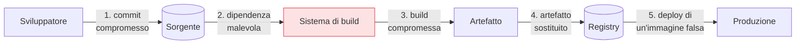

## Perché conta

La [SBOM]() dice *cosa* c'è in un artefatto. Ma un attaccante
sofisticato non ha bisogno di inserire una dipendenza vulnerabile: gli basta compromettere la
**pipeline** che costruisce l'artefatto, iniettando codice *dopo* il sorgente pulito e *prima*
dell'immagine finale. SolarWinds ha funzionato così: codice benigno nel repository, backdoor inserita
durante la build. **SLSA** (Supply-chain Levels for Software Artifacts) esiste per rendere la build
stessa verificabile.

## La superficie d'attacco della supply chain

Ogni anello tra il codice di uno sviluppatore e l'artefatto in produzione è un bersaglio:



I controlli visti finora proteggono soprattutto l'anello 1-2 (il codice e le dipendenze). SLSA si
concentra sull'anello **3-4**: garantire che l'artefatto in produzione sia *esattamente* quello
prodotto dalla build attesa, a partire dal sorgente atteso, senza manomissioni intermedie.

## La provenienza: il documento chiave

Il concetto centrale di SLSA è la **provenance**: un documento, generato *dal sistema di build stesso*
e firmato, che attesta "io, questa build, ho prodotto questo artefatto (hash X), da questo sorgente
(commit Y), con questi parametri". Verificare la provenienza prima del deploy significa rifiutare
qualsiasi artefatto che non possa dimostrare la propria origine.

```text {hl_lines=[3,4]}
Provenance (semplificata):
  artefatto:  sha256:abc...        ← cosa
  sorgente:   git@...#commit def   ← da dove
  builder:    github-actions@...   ← chi l'ha costruito
  firmata dal builder → non falsificabile da chi non controlla il builder
```

## I livelli di SLSA

SLSA non è tutto-o-niente: è una scala che alza progressivamente le garanzie.

- **Livello 1 — provenienza presente**: la build genera la provenienza. Non ancora a prova di
  manomissione, ma esiste e dà trasparenza.
- **Livello 2 — provenienza firmata**: generata da un servizio di build ospitato e *firmata*, quindi
  verificabile e non banalmente falsificabile.
- **Livello 3 — build indurita**: il sistema di build è isolato, le sorgenti e i parametri sono
  verificati, la provenienza è *non falsificabile* anche da chi ha accesso al progetto. È il livello
  che avrebbe reso molto più difficile un attacco in stile SolarWinds.

(Le revisioni del framework rinumerano e articolano i livelli, ma la direzione è costante: da "la
provenienza esiste" a "la provenienza è inattaccabile".)

## Cosa significa in pratica

Salire di livello è soprattutto *disciplina di pipeline*: build effimere e isolate (niente runner
persistenti che accumulano stato), nessuna modifica manuale all'artefatto, provenienza generata
automaticamente, deploy che *verifica* la provenienza come gate. Molto di questo si appoggia alla
firma crittografica, il tassello del prossimo capitolo.


<details>
<summary><strong>Domanda:</strong> ho già SAST, SCA, code review e secret scanning sul mio codice; se il mio sorgente è pulito e controllato, perché dovrei preoccuparmi di SLSA e della build?</summary>
<p>Perché tutti i controlli che hai elencato verificano il <em>sorgente</em>, e la lezione di SolarWinds è
esattamente che il sorgente può essere immacolato mentre l'artefatto spedito è compromesso. Tra il commit
che hai revisionato e l'immagine che gira in produzione c'è un intero sistema — il runner della CI, gli
script di build, la cache delle dipendenze, i plugin, le credenziali che pubblicano sul registry — e nulla
di ciò che fai sul sorgente lo protegge. Un attaccante che ottiene l'accesso al sistema di build non ha
bisogno di toccare il tuo repository: inietta la backdoor <em>durante</em> la compilazione, l'artefatto
finale contiene codice che non comparirà mai in nessuna code review perché non è mai stato nel sorgente, e
la tua SBOM lo elencherà come se fosse legittimo. Lo stesso vale per l'anello successivo: qualcuno che
compromette il registry può sostituire la tua immagine con un'altra, e senza verifica della provenienza il
cluster la deploierà fiducioso. SLSA chiude proprio questo divario, ortogonale ai controlli sul codice: la
provenienza firmata lega l'artefatto al commit esatto e alla build esatta, così al momento del deploy puoi
<em>rifiutare</em> qualunque cosa non dimostri di essere nata dal tuo sorgente pulito attraverso la tua
build attesa. Non sostituisce SAST o SCA — quelli garantiscono che il sorgente sia buono — ma garantisce
che ciò che spedisci sia davvero quel sorgente e non qualcosa che gli somiglia. Senza, hai verificato
accuratamente l'ingresso di un tubo di cui non controlli l'uscita.</p>
</details>


## Conclusione

SLSA sposta la fiducia dal solo sorgente all'intera build: la provenienza firmata attesta cosa è stato
costruito, da dove e da chi, e i livelli alzano progressivamente le garanzie fino a renderla
inattaccabile. Ma "firmata" presuppone un sistema di firma che non richieda a ognuno di gestire chiavi
private — storicamente il motivo per cui quasi nessuno firmava. Sigstore risolve questo, prossimo
capitolo.
