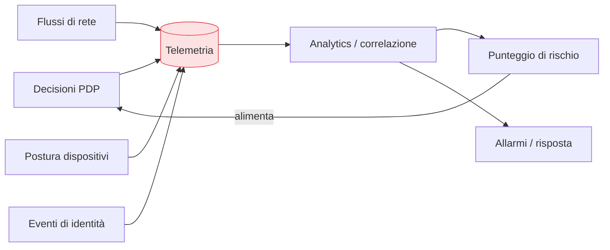

## Perché conta

L'[accesso adattivo]() decide in base al
rischio; ma il rischio è una parola vuota senza **dati** che lo misurino. "Non fidarsi mai,
verificare sempre" implica un corollario spesso ignorato: **vedere sempre**. Lo Zero Trust produce
un fiume di segnali — ogni decisione del [PDP](),
ogni handshake [mTLS](), ogni cambio di
[postura]() — e la telemetria è il sistema nervoso che li
raccoglie, li correla e li rimanda alle decisioni. Senza, lo Zero Trust è cieco.

## Il ciclo si chiude

È un **anello di retroazione**: le decisioni producono segnali, i segnali alimentano l'analisi del
rischio, il rischio guida le decisioni successive. Lo Zero Trust non è una barriera statica ma un
sistema che si osserva e si corregge.

## Cosa raccogliere

I segnali che contano attraversano tutti i livelli della serie:

| Fonte | Segnali |
|---|---|
| Identità / IdP | login, step-up, fallimenti, concessioni JIT |
| Dispositivi | cambi di postura, conformità, EDR |
| Rete | flussi est-ovest, connessioni negate dalla microsegmentazione |
| Workload / mesh | chiamate tra servizi, autorizzazioni negate, latenze |
| PDP | ogni decisione consenti/nega e il perché |

La chiave è la **normalizzazione** (lo stesso concetto del
[SIEM]()): rendere comparabili segnali di origine diversa,
così da poter chiedere "tutto ciò che riguarda questa identità" e vedere identità, dispositivo, rete
e workload insieme.

## Dalla raccolta alla correlazione

La telemetria grezza è rumore; il valore è nella **correlazione**. Un login riuscito è normale; un
login da un paese nuovo, seguito da una concessione JIT su un sistema critico, seguita da un volume
di traffico anomalo verso l'esterno, è una storia. È lo stesso lavoro del
[SIEM](), qui alimentato dai segnali ricchi dello Zero
Trust, e spesso arricchito da **UEBA** (User and Entity Behavior Analytics): modelli che imparano il
comportamento normale di ogni identità e segnalano le deviazioni.

## Il doppio uso dei dati

La telemetria serve due scopi, entrambi essenziali:

1. **In tempo reale**: alimenta il punteggio di rischio della
   [verifica continua](). Un segnale di
   compromissione restringe l'accesso **ora**.
2. **In analisi / forense**: ricostruire cosa è successo, misurare la copertura rispetto ad
   ATT&CK, affinare le policy. "Quali accessi ha fatto questa identità nelle ultime 24 ore,
   ovunque?" è una domanda a cui lo Zero Trust deve saper rispondere.

## Il rischio da evitare: raccogliere senza guardare

L'anti-pattern è accumulare log che nessuno legge: costo di storage e falsa sicurezza. La telemetria
ha valore solo se **chiude l'anello** — se i segnali tornano a influenzare le decisioni e gli
allarmi vengono gestiti. Pochi segnali correlati e azionabili battono terabyte di log inerti. Vale
qui il monito del SIEM: un allarme ignorato è peggio di nessun allarme.

## Lab

Con uno stack di osservabilità/SIEM da laboratorio (Wazuh, o Elastic/OpenSearch + Grafana):

1. Convogliate in un collector i log di un [IdP]()
   (Keycloak), delle decisioni [OPA](), e dei flussi di
   rete.
2. Normalizzate i campi comuni (identità, IP, risorsa) e verificate di poter cercare per identità
   attraverso tutte le fonti.
3. Scrivete una regola di correlazione "accesso anomalo" (paese nuovo + elevazione JIT + volume
   insolito).
4. Collegate l'uscita a un segnale di rischio che modifichi una policy di accesso adattivo.



<strong>Domanda:</strong> raccogliere telemetria su ogni accesso, dispositivo e comportamento non trasforma lo Zero Trust in sorveglianza di massa dei dipendenti?

È una tensione reale e va affrontata con il design, non ignorata. La telemetria dello Zero Trust mira
a <em>decisioni di sicurezza</em>, non al controllo della produttività, e la differenza si costruisce con
scelte concrete: raccogliere i segnali che servono a valutare il rischio di accesso (da dove, con quale
dispositivo, verso quale risorsa) e non il contenuto del lavoro; minimizzare e pseudonimizzare dove
possibile; definire retention limitate; e soprattutto essere trasparenti con le persone su cosa si
raccoglie e perché. C'è anche un vincolo legale — GDPR e normative sul lavoro impongono proporzionalità
e finalità — che va rispettato per progetto, non aggirato. Il punto etico è che lo scopo è proteggere
l'organizzazione <em>e</em> le persone da compromissioni, non misurare quanto lavorano: una telemetria
che scivola nella seconda cosa perde la fiducia dei dipendenti e, con essa, la collaborazione da cui
dipende. Vedere tutto ciò che serve alla sicurezza non significa vedere tutto: la minimizzazione è essa
stessa un principio Zero Trust applicato ai dati che raccogliamo su noi stessi.



## Conclusione

La telemetria è il sistema nervoso dello Zero Trust: raccoglie e correla i segnali di identità,
dispositivi, rete e workload, li usa in tempo reale per il rischio e in analisi per la forense e
l'affinamento. Chiude l'anello tra decisione e segnale, trasformando il modello da barriera statica
a sistema che si osserva. Da qui in poi estendiamo lo Zero Trust oltre la rete interna: il prossimo
capitolo lo porta nel cloud.
