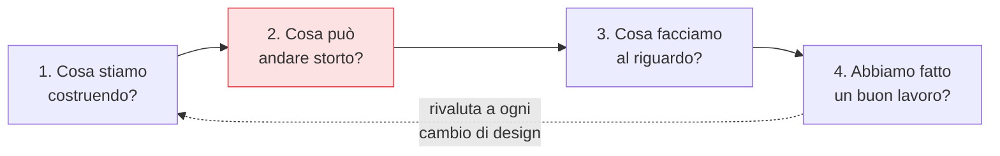

## Perché conta

Il [Secure SDLC]() colloca il threat modeling nel design, la fase
più economica in assoluto: qui un difetto costa una gomma su una lavagna. Lo stesso ragionamento
l'abbiamo già applicato alle reti nel post sul [threat modeling delle reti]();
qui lo portiamo dentro il ciclo di sviluppo del software, dove diventa un'abitudine ricorrente e non
un documento scritto una volta e mai più aperto.

## I quattro passi

Il threat modeling risponde a quattro domande, nell'ordine:



1. **Cosa costruiamo**: un diagramma di flusso dei dati (DFD) con i confini di fiducia — dove i dati
   attraversano una frontiera tra componenti con privilegi diversi.
2. **Cosa può andare storto**: si enumerano le minacce, tipicamente con STRIDE.
3. **Cosa facciamo**: per ogni minaccia una mitigazione, un rischio accettato o un trasferimento.
4. **Com'è andata**: si verifica che le mitigazioni esistano davvero nel codice e nei test.

## STRIDE: una lente per le minacce

STRIDE è una checklist mnemonica per non dimenticare categorie di minaccia:

```text {hl_lines=[1,4]}
S  Spoofing        → identità falsificata        → autenticazione
T  Tampering       → dati/codice alterati        → integrità, firme
R  Repudiation     → "non sono stato io"         → log a prova di manomissione
I  Info disclosure → fuga di dati                → cifratura, controllo accessi
D  Denial of svc   → risorsa resa indisponibile  → rate limit, quote
E  Elevation       → privilegi oltre il dovuto   → least privilege, validazione
```

Si scorre ogni elemento del DFD e, per ciascuno, si chiede: può essere vittima di spoofing? di
tampering? e così via. La forza non è la completezza teorica, ma il fatto che *struttura* una
conversazione che altrimenti dipende da chi è il più paranoico nella stanza.

## Renderlo leggero e continuo

Il threat modeling fallisce quando diventa un rito pesante: un documento di 40 pagine, redatto una
volta da un consulente, ignorato da chi scrive il codice. Le pratiche che funzionano in DevSecOps:

- **Incrementale**: si modella la *modifica*, non tutto il sistema, a ogni design significativo.
- **Di squadra**: chi costruisce partecipa; il modello vive nelle loro teste, non in un PDF.
- **Tracciato come codice**: le minacce diventano issue e test, così "l'abbiamo mitigata" è
  verificabile e non un'affermazione.

## Dall'abuse case al test

Ogni minaccia identificata dovrebbe generare qualcosa di eseguibile: un *abuse case* ("un utente non
autenticato tenta di leggere l'ordine di un altro") che diventa un test di sicurezza automatico. Così
il modello non invecchia in silenzio: se qualcuno reintroduce la falla, il test fallisce. È il ponte
tra il design e i controlli di build dei prossimi capitoli.


<details>
<summary><strong>Domanda:</strong> con pipeline che rilasciano dieci volte al giorno, come si fa threat modeling senza bloccare ogni deploy?</summary>
<p>Non si modella ogni deploy: si modella ogni <em>decisione di design</em>, che è molto più rara di un
deploy. La maggior parte dei rilasci sono cambi incrementali dentro un'architettura già modellata — una
nuova colonna, un fix, un endpoint in più su un pattern esistente — e non spostano confini di fiducia:
non richiedono nulla. Il trigger non è il tempo né il commit, è il <em>cambio strutturale</em>: un nuovo
componente, un nuovo flusso di dati verso l'esterno, una nuova integrazione di terze parti, un cambio nel
modello di autenticazione. Quando succede, un threat model leggero di trenta minuti sulla sola modifica
basta, e si fa in fase di design, giorni prima del deploy, non nel percorso critico della pipeline. Alcuni
team lo agganciano alla pull request con una checklist automatica ("questo cambio tocca autenticazione,
dati personali, confini di rete?"): se tutte le risposte sono no, non serve una sessione; se una è sì,
si convoca. Così il controllo pesa solo quando il rischio c'è davvero, e i dieci deploy al giorno di
routine non vengono toccati.</p>
</details>


## Conclusione

Il threat modeling è il controllo più economico perché agisce prima della prima riga di codice:
quattro domande, la lente STRIDE, e minacce trasformate in test che non invecchiano. Ma il design
sicuro vale poco se poi il codice lascia una chiave API in chiaro nel repository. Il primo difetto
concreto da eliminare nel flusso di sviluppo è proprio questo: la gestione dei segreti, prossimo
capitolo.
