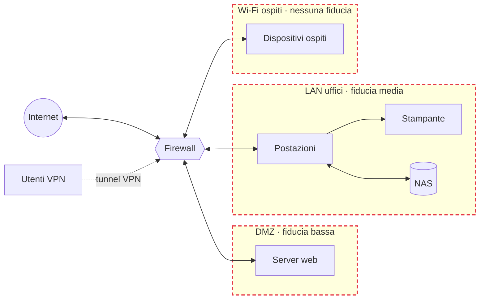

## Perché conta

Quasi ogni rete che ho visto è stata messa in sicurezza al contrario: prima si compra il firewall,
poi si decide cosa deve bloccare. Il risultato sono regole scritte "a sensazione", porte aperte
che nessuno ricorda perché, e zone della rete che si fidano l'una dell'altra senza motivo.

Il threat modeling ribalta l'ordine. Prima si disegna la rete, poi si chiede **cosa può andare
storto**, e solo alla fine si sceglie la difesa. È il capitolo 01 della serie perché tutti i
capitoli successivi rispondono a minacce che troveremo qui.


What are we working on? What can go wrong? What are we going to do about it? Did we do a good enough job?


Quattro domande. Il resto del post le applica una per una.

## Domanda 1: su cosa stiamo lavorando?

L'esempio è un piccolo ufficio, il tipo di rete che si trova in uno studio professionale o in una
startup:

- 15 postazioni e una stampante di rete;
- un NAS con i documenti condivisi;
- una rete Wi-Fi per gli ospiti;
- un server web pubblico in DMZ;
- accesso remoto in VPN per chi lavora da casa.

### Il diagramma

Il diagramma serve a una cosa sola: rendere visibili i **confini di fiducia** (trust boundary),
cioè i punti in cui i dati passano da una zona con un livello di fiducia a un'altra. Le minacce
si concentrano quasi sempre lì.



Ogni riquadro tratteggiato è una zona; ogni freccia che attraversa il firewall attraversa un
confine di fiducia. In questa rete ce ne sono quattro: Internet–firewall, firewall–DMZ,
firewall–LAN e firewall–ospiti. Il tunnel VPN ne aggiunge un quinto.

### L'inventario

Il diagramma deve corrispondere alla rete reale, non a quella che si crede di avere. Una scansione
della LAN dice cosa c'è davvero:

```bash
# Host attivi nella LAN, senza scansione delle porte
sudo nmap -sn 192.168.10.0/24 -oG - | awk '/Up$/{print $2, $3}'

# Servizi esposti sul NAS: spesso ce ne sono più di quanti ne servano
sudo nmap -sV --top-ports 200 192.168.10.20
```

Quasi sempre salta fuori qualcosa che non era nel diagramma: una telecamera IP, un vecchio
access point, un'interfaccia di gestione della stampante raggiungibile in HTTP.

## Domanda 2: cosa può andare storto?

Qui entra STRIDE. È un acronimo che elenca sei categorie di minaccia, ognuna opposta a una
proprietà di sicurezza. Serve a non dimenticare nulla: per ogni elemento del diagramma si passano
in rassegna tutte e sei.

| Lettera | Minaccia | Proprietà violata | Esempio in rete |
|---|---|---|---|
| **S** | Spoofing | Autenticazione | ARP spoofing, DHCP rogue, IP spoofing |
| **T** | Tampering | Integrità | Modifica del traffico in transito, DNS poisoning |
| **R** | Repudiation | Non ripudio | Nessun log delle connessioni VPN |
| **I** | Information disclosure | Riservatezza | Protocolli in chiaro, SNMP con community `public` |
| **D** | Denial of service | Disponibilità | SYN flood, DHCP starvation, broadcast storm |
| **E** | Elevation of privilege | Autorizzazione | Ospite che raggiunge la LAN, VLAN hopping |

### STRIDE applicato ai confini

Applicato ai confini del nostro ufficio, STRIDE produce un elenco come questo (ridotto alle voci
più interessanti):

| ID | Confine | STRIDE | Minaccia |
|---|---|---|---|
| T1 | Ospiti → LAN | E | Un ospite raggiunge il NAS perché la Wi-Fi ospiti e la LAN sono sulla stessa VLAN |
| T2 | Dentro la LAN | S, T | Un PC compromesso fa ARP spoofing e si mette in mezzo tra le postazioni e il gateway |
| T3 | Dentro la LAN | I | Il NAS espone SMBv1 e un'interfaccia web in HTTP |
| T4 | Internet → DMZ | D | SYN flood contro il server web |
| T5 | DMZ → LAN | E | Il server web compromesso apre connessioni verso il NAS |
| T6 | VPN → LAN | R | Gli accessi VPN non vengono registrati: dopo un incidente non si sa chi era collegato |
| T7 | Internet → utenti | T | Risposte DNS falsificate verso le postazioni |

Ogni riga dice **dove** (il confine), **cosa** (la categoria STRIDE) e **come** (lo scenario
concreto). Una minaccia scritta in modo vago, come "il NAS potrebbe essere attaccato", non aiuta
a scegliere una difesa.

## Domanda 3: cosa facciamo?

Non si può risolvere tutto subito. Per decidere l'ordine serve una stima del rischio. La formula
più semplice è anche la più usata:

$$
R = P \times I
$$

dove $P$ è la probabilità che la minaccia si realizzi e $I$ è l'impatto se succede, entrambi su
una scala da 1 a 5. Il risultato va da 1 a 25. Non è una misura precisa: serve solo a
confrontare le minacce tra loro con lo stesso metro.

| ID | $P$ | $I$ | $R$ | Difesa | Capitolo |
|---|---|---|---|---|---|
| T1 | 4 | 5 | **20** | VLAN separata per gli ospiti, nessuna rotta verso la LAN | 03 |
| T5 | 3 | 5 | **15** | Firewall: dalla DMZ nessuna connessione verso la LAN | 04 |
| T2 | 3 | 4 | **12** | Dynamic ARP Inspection, DHCP snooping | 02 |
| T3 | 3 | 4 | **12** | Disattivare SMBv1, HTTPS sull'interfaccia del NAS | — |
| T7 | 2 | 4 | **8** | Resolver con DNSSEC, DoT verso l'esterno | 07 |
| T4 | 2 | 3 | **6** | Rate limiting, SYN cookies, protezione a monte | 08 |
| T6 | 2 | 3 | **6** | Log centralizzati delle sessioni VPN | 09 |

Ordinando per $R$, la priorità diventa evidente: la prima cosa da fare non è comprare un IDS,
ma **separare la rete ospiti**. Costa poco e chiude la minaccia con il rischio più alto.

### Il registro delle minacce

Conviene tenere le minacce in un file versionato accanto alla configurazione della rete. Un
formato semplice basta:

```yaml {hl_lines=[5,6,7]}
- id: T1
  boundary: guest -> lan
  stride: [E]
  threat: Un ospite raggiunge il NAS sulla stessa VLAN
  likelihood: 4
  impact: 5
  risk: 20
  mitigation: VLAN 30 per gli ospiti, ACL deny verso 192.168.10.0/24
  status: open
  owner: rete
```

Le righe evidenziate sono quelle che decidono la priorità. Il campo `status` permette di vedere
a colpo d'occhio cosa resta aperto.

## Domanda 4: abbiamo fatto un buon lavoro?

Un threat model non è mai finito. Va ripreso ogni volta che la rete cambia: un nuovo servizio in
DMZ, un nuovo tipo di dispositivo, un fornitore che chiede l'accesso remoto. Tre controlli
pratici:

1. **Il diagramma corrisponde alla rete?** Ripetere la scansione dell'inventario e confrontare.
2. **Ogni minaccia ha una difesa e un responsabile?** Le righe senza `owner` non vengono chiuse.
3. **Le difese funzionano?** Provarle davvero. Ad esempio, da un dispositivo nella Wi-Fi ospiti:

```bash
# Deve fallire: gli ospiti non devono raggiungere il NAS
nc -zv -w 3 192.168.10.20 445 && echo "T1 ANCORA APERTA" || echo "T1 chiusa"
```

## Lab

Prendete la rete di casa vostra (o del laboratorio descritto nella
[roadmap]()) e rispondete alle quattro domande:

1. Disegnate il diagramma con le zone e i confini di fiducia.
2. Applicate STRIDE ad almeno tre confini.
3. Calcolate $R$ per ogni minaccia e ordinatele.
4. Scegliete la prima difesa da applicare e verificate che funzioni.


<details>
<summary><strong>Suggerimento:</strong> la minaccia che quasi tutti trovano a casa</summary>
<p>I dispositivi IoT (TV, prese smart, telecamere) stanno quasi sempre sulla stessa rete dei PC e
del NAS. Sono dispositivi che non ricevono aggiornamenti e che parlano con server esterni: in
STRIDE è una minaccia di tipo <strong>E</strong> (un dispositivo compromesso raggiunge tutto il resto),
con probabilità alta. La difesa è la stessa della rete ospiti: una rete separata, con accesso
solo verso Internet. Molti router domestici la offrono già come "rete ospiti" o "rete IoT".</p>
</details>


## Conclusione

Il threat modeling non richiede strumenti costosi: un diagramma, una tabella e quattro domande.
Il valore sta nell'ordine che impone: prima capire la rete, poi scegliere le difese in base al
rischio, non all'abitudine.

Le minacce trovate qui sono la scaletta dei prossimi capitoli. Si parte dalla T2, perché è la più
sottovalutata: un attaccante già dentro la LAN che si mette in mezzo al traffico.

**Prossimo nella serie:** 02 · Attacchi a livello 2: ARP spoofing, MAC flooding e DHCP starvation ·
[Torna alla roadmap]()
