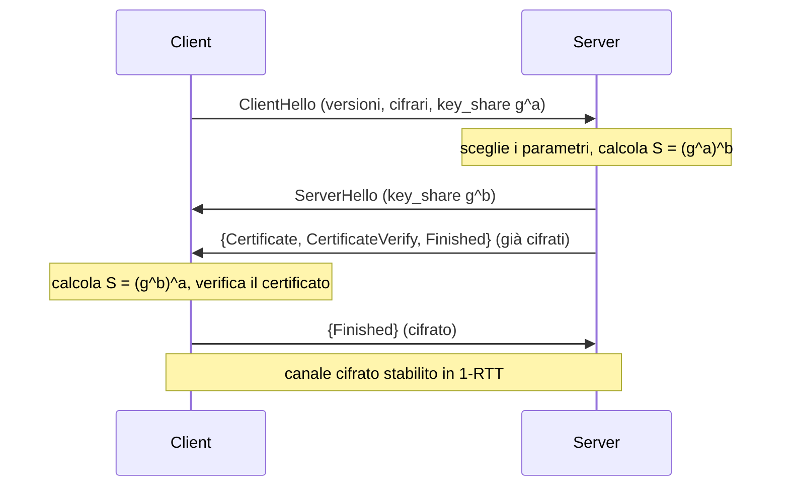
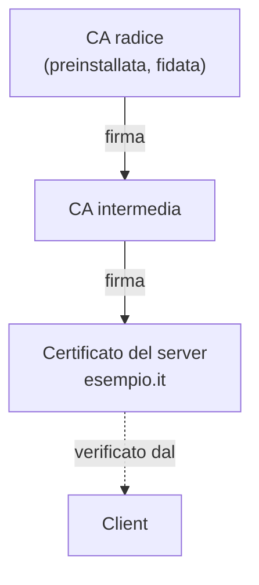

## Perché conta

Tutti gli attacchi dei capitoli precedenti — ARP spoofing, DHCP rogue, uomo nel mezzo — hanno lo
stesso punto debole come bersaglio: il traffico in chiaro. TLS è la risposta. Risolve un problema
che sembra impossibile: due macchine che non si sono mai parlate devono accordarsi su una chiave
segreta, mentre un attaccante registra ogni byte che si scambiano. E devono anche essere sicure di
parlare con chi credono, non con l'uomo nel mezzo.

TLS 1.3 (RFC 8446, 2018) ha ripulito vent'anni di debolezze. Vediamo come funziona.

## Il problema dello scambio di chiavi

La cifratura simmetrica è veloce ma richiede una chiave condivisa. Come la si concorda su un canale
che l'attaccante ascolta? La risposta è lo scambio **Diffie-Hellman**, in TLS 1.3 nella variante
su curve ellittiche (**ECDHE**).

L'idea, semplificata: client e server scelgono ciascuno un segreto privato ($a$ e $b$) e si
scambiano un valore pubblico derivato. Grazie alla proprietà matematica dello scambio, entrambi
calcolano lo stesso segreto condiviso $S$ senza mai trasmetterlo:

$$
S = g^{ab} \bmod p
$$

L'attaccante vede passare $g^a$ e $g^b$, ma per ricavare $S$ dovrebbe risolvere il problema del
logaritmo discreto, computazionalmente proibitivo con i parametri usati. La chiave non viaggia mai
sul filo: viene **calcolata** alle due estremità.

## L'handshake TLS 1.3

La novità più visibile di TLS 1.3 è la velocità: l'handshake si completa in **un solo giro**
(1-RTT), contro i due di TLS 1.2. Il client azzarda i parametri già nel primo messaggio.



Dal `ServerHello` in poi **tutto è già cifrato**, inclusi il certificato del server. In TLS 1.2 il
certificato viaggiava in chiaro.

## Autenticazione: la catena di certificati

Lo scambio ECDHE protegge dall'ascolto, ma non dall'uomo nel mezzo: un attaccante potrebbe fare un
proprio scambio con il client fingendosi il server. Serve **autenticazione**, e la dà la PKI.

Il server presenta un **certificato** che lega il suo nome di dominio a una chiave pubblica,
firmato da una **Certificate Authority (CA)**. Il client verifica la firma risalendo la catena
fino a una CA radice di cui si fida già (sono preinstallate nel sistema).



In `CertificateVerify` il server firma l'handshake con la chiave privata corrispondente al
certificato: prova di possedere la chiave, non solo di esibire il certificato. Un uomo nel mezzo
non ha quella chiave privata, quindi non può produrre quella firma.

## Due proprietà che contano

**Forward secrecy.** In TLS 1.3 ogni connessione usa una coppia ECDHE **effimera**, nuova ogni
volta e cancellata dopo. Se un attaccante registra oggi il traffico cifrato e tra un anno ruba la
chiave privata del server, **non** può decifrare quel traffico: la chiave di sessione non derivava
da quella del server, ed è sparita. TLS 1.2 lo permetteva solo con i cifrari giusti; 1.3 lo rende
obbligatorio.

**Niente cifrari deboli.** TLS 1.3 ha rimosso dalla negoziazione RC4, 3DES, MD5, lo scambio RSA
statico e la rinegoziazione. Molti attacchi storici (BEAST, POODLE, downgrade) sfruttavano proprio
quelle opzioni: toglierle dal protocollo le chiude per costruzione.

## Vederlo nel lab

Con `openssl` si ispeziona un handshake reale:

```bash
# handshake completo verso un server, con dettagli
openssl s_client -connect esempio.it:443 -tls1_3

# guardare il certificato e la sua catena
openssl s_client -connect esempio.it:443 -showcerts </dev/null 2>/dev/null \
  | openssl x509 -noout -subject -issuer -dates
```

Nel lab containerlab si può generare una CA di test, emettere un certificato per un server interno
e osservare la verifica della catena, senza toccare internet.

## La configurazione lato server

```nginx {hl_lines=[2,3]}
# solo TLS 1.2 e 1.3; niente versioni vecchie
ssl_protocols TLSv1.2 TLSv1.3;
ssl_prefer_server_ciphers off;         # in 1.3 la lista cifrari è già sicura
ssl_session_tickets off;               # i ticket possono indebolire la forward secrecy
```

Le due righe evidenziate sono il minimo: disattivare le versioni obsolete e lasciare a TLS 1.3 la
scelta dei cifrari, che sono già tutti robusti.

## Lab

1. Nel lab, create una CA di test (`openssl req -x509 ...`) ed emettete un certificato per un
   server interno.
2. Avviate un server TLS 1.3 (`openssl s_server`) e collegatevi con `openssl s_client`.
3. Osservate con quale `key_share` e cifrario si conclude l'handshake.
4. Provate a forzare `-tls1_1`: il server deve rifiutare.


<details>
<summary><strong>Domanda:</strong> se tutto è cifrato, l'IDS del capitolo 05 serve ancora a qualcosa?</summary>
<p>Sì, ma vede meno. Con TLS, un IDS passivo non legge il contenuto HTTP: vede solo i metadati —
indirizzi IP, dimensioni e tempi dei pacchetti, e il nome del server nell'estensione SNI (in chiaro
anche in TLS 1.3, salvo ECH). Può ancora rilevare schemi (scan, beaconing di malware, destinazioni
note come malevole), ma non il payload. Per ispezionare il contenuto cifrato servirebbe la
decifratura TLS (un proxy che termina e ri-origina la connessione), che però rompe la forward
secrecy end-to-end e introduce un punto in cui il traffico è di nuovo in chiaro. È un compromesso
di sicurezza serio, non una funzione da attivare a cuor leggero.</p>
</details>


## Conclusione

TLS 1.3 risolve due problemi distinti con due meccanismi distinti: ECDHE per la segretezza
(nessuno ascolta), la PKI per l'autenticazione (parli con chi credi). La forward secrecy
obbligatoria e l'eliminazione dei cifrari deboli chiudono per costruzione gli attacchi che
affliggevano le versioni precedenti.

TLS protegge il _trasporto_. Ma prima ancora di aprire una connessione, il client deve sapere
quale IP ha `esempio.it`: lo chiede al DNS. E il DNS, per impostazione predefinita, è in chiaro e
senza autenticazione — il prossimo bersaglio.

**Prossimo nella serie:** [07 · Sicurezza del DNS: DNSSEC e DoH]() ·
[Torna alla roadmap]()
