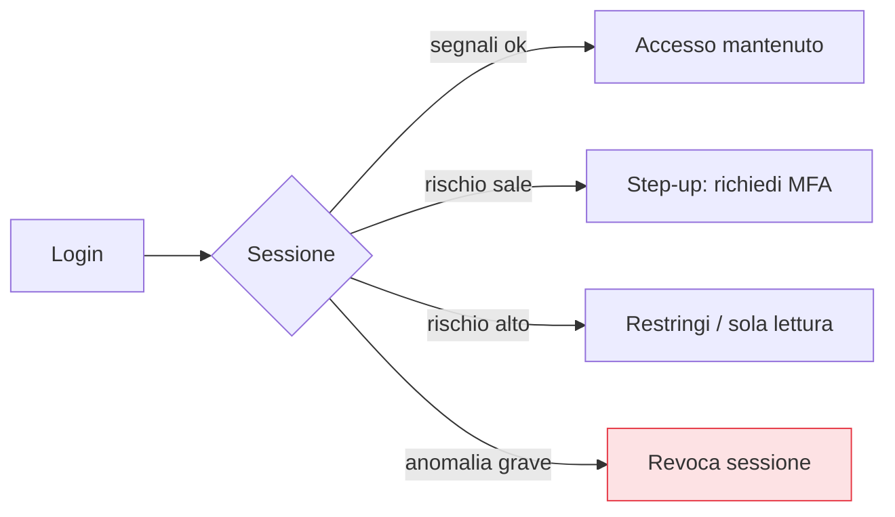

## Perché conta

Il quinto dei [cinque principi]() è quello che
distingue lo Zero Trust maturo da un semplice "login forte": l'accesso **non è un evento, è uno
stato**. Un modello che verifica tutto perfettamente al login ma poi lascia la sessione aperta per
otto ore ha solo spostato il perimetro al momento dell'autenticazione. Se a metà giornata il
dispositivo viene compromesso o il comportamento diventa anomalo, nulla reagisce. La verifica
continua rivaluta l'accesso nel tempo; l'accesso adattivo lo commisura al rischio del momento.

## Da cancello a condizione



La decisione del [PDP]() non viene presa una
volta e dimenticata: viene **rinnovata** a intervalli e a eventi. Token a vita breve
([identità]()) sono il meccanismo di base — ogni
rinnovo è una nuova occasione di rivalutare — ma la verifica continua va oltre, reagendo ai segnali
mentre la sessione è viva.

## Il punteggio di rischio

L'accesso adattivo combina i segnali in una valutazione del **rischio** della richiesta:

| Segnale | Abbassa il rischio | Alza il rischio |
|---|---|---|
| Dispositivo | gestito, conforme ([postura]()) | sconosciuto, non conforme |
| Posizione / rete | abituale | paese insolito, IP anonimizzante |
| Comportamento | coerente con lo storico | orario anomalo, volume inusuale |
| Risorsa | bassa sensibilità | dati critici |

Il rischio risultante decide la **risposta**: consentire in silenzio, chiedere un fattore in più
(step-up), restringere i privilegi, o revocare.

## La chiave: attrito proporzionale al rischio

Qui si scioglie il malinteso che lo Zero Trust sia "sempre più fastidioso". L'accesso adattivo è
pensato per essere **invisibile quando il rischio è basso**: identità, dispositivo e contesto soliti
→ nessuna richiesta aggiuntiva. La frizione compare **solo** quando qualcosa è anomalo — ed è
esattamente lì che la vogliamo.

```text {hl_lines=[2,3,4]}
# risposta in funzione del rischio
rischio basso:   accesso trasparente (nessun prompt)
rischio medio:   step-up (MFA resistente al phishing)
rischio alto:    accesso ridotto o negato, sessione rivalutata
```

Rispetto alla VPN classica — che chiede login e token a ogni connessione a prescindere — un modello
adattivo ben fatto riduce l'attrito medio, concentrandolo dove serve.

## Continuous access evaluation

Il meccanismo moderno che rende reattiva la sessione è la **valutazione continua degli accessi**:
invece di aspettare la scadenza del token (anche solo un'ora), l'IdP e i servizi si scambiano
**eventi** — "questo utente è stato disabilitato", "il dispositivo ha perso la conformità", "rischio
elevato rilevato" — e la sessione viene rivalutata o chiusa **subito**. Chiude la finestra tra "il
rischio è cambiato" e "il prossimo rinnovo del token".

## Il prerequisito: i segnali

L'accesso adattivo è buono quanto i segnali che lo alimentano. Senza telemetria su identità,
dispositivi e comportamento, il "rischio" è una parola vuota. Per questo il capitolo successivo è
dedicato alla telemetria: è il sistema nervoso senza cui la verifica continua non vede nulla.

## Lab

Con un IdP che supporti policy di accesso condizionale/adattivo (Keycloak con flussi condizionali, o
regole in un reverse proxy + [OPA]()):

1. Definite una policy che consenta l'accesso trasparente da un contesto "normale" (device conforme,
   rete nota).
2. Introducete un segnale di rischio (login da IP/paese diverso) e configurate uno **step-up** MFA.
3. Simulate un peggioramento della postura a sessione avviata e verificate che l'accesso si
   restringa senza nuovo login.
4. Revocate l'utente e osservate la sessione cadere il prima possibile, non alla scadenza del token.


<details>
<summary><strong>Domanda:</strong> valutare il rischio in continuazione non rischia di bloccare utenti legittimi per falsi positivi — un viaggio, una VPN personale, una giornata diversa dal solito?</summary>
<p>Il rischio di falsi positivi è reale, ed è il motivo per cui la risposta corretta è quasi mai "blocca"
e quasi sempre "chiedi conferma". Un segnale anomalo — sei in un altro paese, usi una rete nuova — non
deve negare l'accesso, deve innescare uno <em>step-up</em>: una verifica in più (una
<a href="/p/mfa-resistente-al-phishing/">passkey</a>) che l'utente legittimo supera in due secondi e
l'attaccante no. Così l'anomalia benigna costa un tocco, non una giornata persa. Il blocco secco si
riserva ai casi gravi e combinati (dispositivo non gestito <em>e</em> paese a rischio <em>e</em> accesso
a dati critici), dove il falso positivo è raro e il costo del falso negativo altissimo. E i modelli
imparano: il "nuovo" paese, dopo una conferma, entra nello storico e smette di essere anomalo. L'errore
da evitare è trattare ogni deviazione come una minaccia binaria; l'accesso adattivo fatto bene gradua la
risposta, e la gradazione è proprio ciò che tiene bassi sia i falsi positivi sia i falsi negativi.</p>
</details>


## Conclusione

Lo Zero Trust maturo tratta l'accesso come uno stato da rivalutare, non un cancello da aprire una
volta: il rischio si ricalcola di continuo dai segnali, e la risposta — trasparente, step-up,
ridotta, revocata — è proporzionale. Fatto bene, riduce l'attrito concentrandolo dove il rischio è
reale. Tutto questo dipende dalla qualità dei segnali: il prossimo capitolo costruisce il sistema
nervoso dello Zero Trust, la telemetria.
