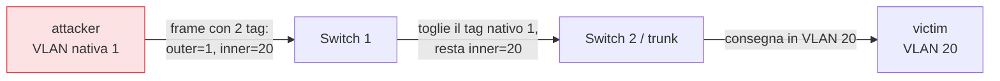

## Perché conta

La segmentazione in VLAN è la risposta alla minaccia T1 del
[threat model](): la rete ospiti e la LAN uffici
sulla stessa infrastruttura fisica, ma su VLAN diverse, senza rotte tra loro. Funziona finché un
attaccante non riesce a **uscire dalla propria VLAN**. Il VLAN hopping fa esattamente questo, e
nei due casi classici non sfrutta un bug: sfrutta configurazioni lasciate ai valori di default.

## Ripasso: tag, access e trunk

Un frame che viaggia in una VLAN porta un tag 802.1Q: 12 bit che dicono a quale VLAN appartiene.
Le porte dello switch sono di due tipi:

- **access**: appartiene a una sola VLAN; i frame entrano ed escono senza tag.
- **trunk**: porta più VLAN tra switch; i frame viaggiano con il tag, tranne quelli della **VLAN
  nativa**, che per compatibilità storica vanno **senza tag**.

Quest'ultima eccezione — la VLAN nativa non taggata — è la porta d'ingresso di entrambi gli
attacchi.

## Attacco 1: switch spoofing (DTP)

Sugli switch Cisco il **Dynamic Trunking Protocol (DTP)** negozia automaticamente se una porta
diventa trunk. Di default molte porte sono in `dynamic auto` o `dynamic desirable`: se l'altro
lato chiede un trunk, lo switch glielo concede.

L'attaccante finge di essere uno switch e chiede un trunk. Se la porta accetta, da quel momento
l'attaccante riceve il traffico di **tutte** le VLAN che passano sul trunk.

```bash
# yersinia fa la negoziazione DTP fingendosi uno switch
yersinia dtp -attack 1 -interface eth1
```

> Nota sul lab: DTP è un protocollo proprietario Cisco. Open vSwitch non lo parla, quindi questo
> attacco si riproduce solo in GNS3 con un'immagine Cisco IOSvL2 (o IOU). Le immagini Cisco non
> sono redistribuibili: per il resto della serie restiamo su containerlab.

## Attacco 2: double tagging

Questo funziona anche senza DTP, su qualunque switch 802.1Q, ed è il motivo per cui la VLAN
nativa non va mai usata per host reali. L'attaccante, su una porta access della VLAN nativa (VLAN
1), costruisce un frame con **due** tag: uno esterno (VLAN 1, quella nativa) e uno interno (la
VLAN bersaglio, es. VLAN 20).



Il primo switch toglie il tag esterno — è la VLAN nativa, va rimossa — e inoltra il frame sul
trunk. A quel punto resta solo il tag interno, VLAN 20: il secondo switch lo consegna nella VLAN
bersaglio. Il frame ha saltato la VLAN. È **monodirezionale** (la risposta non torna indietro
allo stesso modo), ma basta per iniettare pacchetti, ad esempio un DHCP rogue in un'altra VLAN.

Nel lab con Open vSwitch si riproduce configurando le porte e inviando un frame a doppio tag:

```bash
# porta attaccante: access sulla VLAN nativa 1; porta vittima: trunk con VLAN 20
ovs-vsctl set port p-attacker tag=1
ovs-vsctl set port p-victim   trunks=1,20
```

```python
from scapy.all import Ether, Dot1Q, IP, ICMP, sendp
# doppio tag: outer VLAN 1 (nativa), inner VLAN 20 (bersaglio)
frame = (Ether()/Dot1Q(vlan=1)/Dot1Q(vlan=20)/IP(dst="10.0.20.10")/ICMP())
sendp(frame, iface="eth1")
```

## La difesa: hardening dello switch

Quattro regole chiudono entrambi gli attacchi. Le prime due riguardano il double tagging, le
ultime due lo switch spoofing.

```text {hl_lines=[2,5]}
! 1. spegni esplicitamente DTP su tutte le porte di accesso
switchport mode access
switchport nonegotiate
! 2. la VLAN nativa del trunk deve essere una VLAN "morta", non usata da nessun host
switchport trunk native vlan 999
! 3. consenti sul trunk solo le VLAN che servono davvero
switchport trunk allowed vlan 10,20,30
! 4. metti in shutdown le porte inutilizzate e assegnale a una VLAN inesistente
```

Le due righe evidenziate sono le decisive:

- `switchport nonegotiate` spegne DTP: la porta non negozia più nulla, lo switch spoofing fallisce.
- `switchport trunk native vlan 999` sposta la VLAN nativa su una VLAN che non contiene host.
  Il double tagging ha bisogno che l'attaccante sia **sulla** VLAN nativa: se la nativa è una VLAN
  morta, nessun attaccante ci si trova, e l'attacco non parte.

La regola generale: **la VLAN nativa non deve mai coincidere con una VLAN di dati**, e DTP va
sempre spento a mano.

## Lab

1. Con Open vSwitch, configurate `p-attacker` come access VLAN 1 e `p-victim` come trunk con VLAN 20.
2. Da `victim`, catturate il traffico sulla VLAN 20 (`tcpdump -i eth1.20`).
3. Da `attacker`, inviate il frame a doppio tag con lo script scapy.
4. Verificate che l'ICMP arrivi sulla VLAN 20, pur partendo dalla VLAN 1.
5. Cambiate la VLAN nativa del trunk (`ovs-vsctl set port p-victim ... tag`) e ripetete.


<details>
<summary><strong>Domanda:</strong> perché il double tagging è monodirezionale?</summary>
<p>Il trucco funziona solo all'andata, perché sfrutta il fatto che il <em>primo</em> switch rimuove
il tag della VLAN nativa. La vittima, rispondendo, invia un frame normale a singolo tag nella VLAN
20: quando arriva allo switch non c'è nessun tag nativo da togliere che la rimandi magicamente nella
VLAN 1 dell'attaccante. Per questo il double tagging si usa per <em>iniettare</em> (un DHCP rogue, un
pacchetto malevolo), non per instaurare una sessione bidirezionale.</p>
</details>


## Conclusione

Il VLAN hopping non buca la cifratura né sfrutta un difetto del protocollo: sfrutta due default.
DTP che negozia da solo e la VLAN nativa condivisa con gli host. Spegnere DTP e isolare la VLAN
nativa sono due righe di configurazione che molti dimenticano.

Finora abbiamo lavorato sotto il livello 3. Dal prossimo capitolo saliamo: un firewall stateful
che decide quale traffico IP può attraversare i confini di fiducia disegnati nel threat model.

**Prossimo nella serie:** [04 · Firewall stateful con nftables]() ·
[Torna alla roadmap]()
