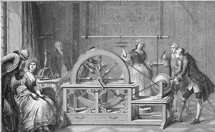

+++
title = "1_R"
date = 2021-09-29T20:03:36+02:00
description = "Statistic and its reaches out:An introduction to the world of statistics"
draft = false
toc = false
categories = ["statistic"]
tags = ["after", "statistic"]
images = [
  "https://source.unsplash.com/collection/983219/1600x900"
] # overrides site-wide open graph image

[[resources]]
  src = "images/1.jpg"
  name = "header thumbnail"
+++

## Statistics: “The science of kings, political and science of statecraft.”[1]

Statistics is the discipline that concerns the collection, organization, analysis, interpretation, and presentation of data.[2]

## Statistics Application domain

Statistics is a very old subject
in fact, early writings on statistical inference can be found in the VII century,[2] but its reach out continue to evolve even today  nevertheless  is  an essential tool to deal with any sort of data, make reports and provide governance tools.

### Is a branch of mathematic? 

Statistics use mathematics to interact and manipulate data, when we are dealing with the application of probability theory inside the statistic we are defacto talking about mathematical statistics, people tend to identify this with  statistics itself saying that  statistics is a branch of mathematics, but this is no more true as saying that engineering is a branch of mathematic [3]

[4] "Mathematics is a  branch of science that involves studying logic and structure on an abstract level.It should also be noted that while only certain parts of mathematics are considered "pure", mathematics is more than just applied statistics in the sense that all areas of study are connected by a set of common foundations and ideas."
[4]"Statistics is a discipline that applies the principles of mathematics to scientific data. It focuses on methods for summarizing and communicating the results of surveys, experiments, or observations. 
Statistics help inform us about everything from what popular movies are out, how many people were convicted of crimes last year, whether global warming is occurring, etc. 
Unlike pure mathematics, statistics deals with attempting to make statements about reality using empirical evidence."

### Could be consider a science?

Science is the mapping of nature into a form that humans can understand,so every discipline or art fallling into this definition is considerble as  a science.
However the interpretation of statistics is usualy colser to an art, a technology,or as a tool[5] but since statistics enables a researcher to draw meaningful conclusions from masses of data[6] and uses the scientific method to drow conclusion for sure it can be recognized as a science.

#### The scientic method:

1. review of facts, theories, and proposals, 
2. Formulation of a logical hypothesis that can be evaluated by  experimental  methods 
3. Objective evaluation of the hypothesis on the basis of experimental results. 

##### Is application in Statistics

Its application lies in many aspects of the design of the experiment but generaly include:

1. Initial planning of the experiment, 
2. Collection of data, 
3. Analysis of results, 
4. Summarizing of the data, and 
5. Evaluation of the uncertainty of any statistical inference drawn from the 
results. [6]

#  Fun Facts
Statistics is probabably at the base of  Psychohistory

#  Bibliography

[1]"EMATHZONE", "url": "https://www.emathzone.com/tutorials/basic-statistics/definition-of-statistics.html"

[2]"Wiki-Statistica","url": "https://it.wikipedia.org/wiki/Statistica"

[3]"Quora:Is-statistics-a-branch-of-mathematics-or-a-discipline-of-its-own","url": "https://www.quora.com/Is-statistics-a-branch-of-mathematics-or-a-discipline-of-its-own"

[4]"Quora: the-difference-between-mathematics-and-statistics"","url": "https://www.quora.com/What-is-the-difference-between-mathematics-and-statistics"

[5]" Journal of the Royal Statistical Society","url":"https://www.jstor.org/stable/2344809"

[5]"ndsu:statistics review ","url":"https://www.ndsu.edu/faculty/horsley/Stat_rev.pdf"

[7]"Foundation","url":"https://asimov.fandom.com/wiki/Psychohistory"
