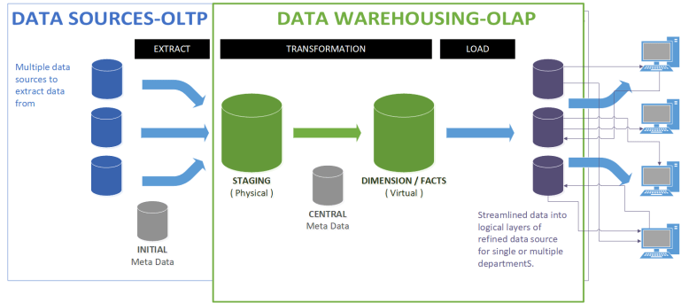
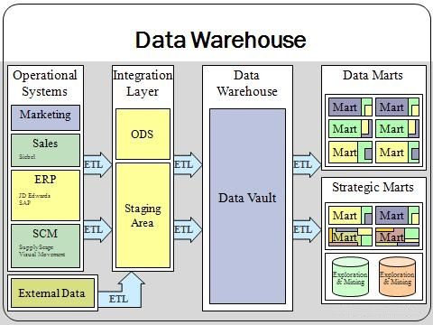
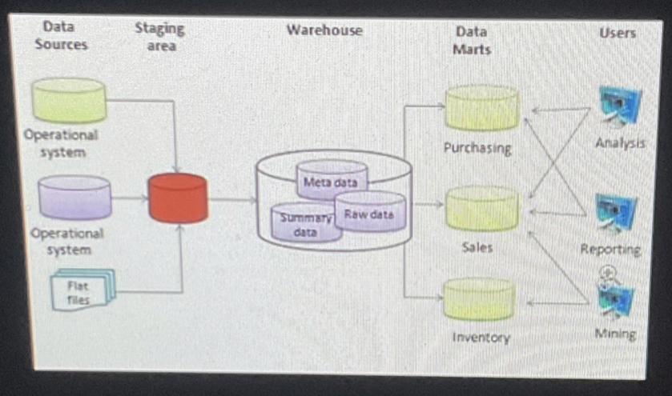

+++
title = "2_R"
date = 2021-10-05T20:03:36+02:00
description = "description of the configuration of data repositories in the real world and corporate environment."

draft = false
toc = false
categories = ["statistic"]
tags = ["after", "statistic"]
images = [
  "https://source.unsplash.com/collection/983219/1600x900"
] # overrides site-wide open graph image

[[resources]]
  src = "images/1.jpg"
  name = "header thumbnail"

+++

## 2_R assignament

### Request

 Describe the most common configuration of data repositories in the real world and corporate environment. Concepts such as Operational or Transactional systems (OLTP), Data Warehouse DW, Data Marts, Analytical and statistical systems (OLAP), etc. Try to draw a conceptual picture of how all these components may work together and how the flow of data and information is processed to extract useful knowledge from raw data.

### Online transaction processing 

OLTP or Online Transaction Processing is a type of data processing that consists of executing a number of transactions occurring concurrently—online banking, shopping, order entry, or sending text messages, for example. These transactions traditionally are referred to as economic or financial transactions, recorded and secured so that an enterprise can access the information anytime for accounting or reporting purposes. [1]

### Online analytical processing

OLTP enables the real-time execution of large numbers of transactions by large numbers of people, whereas online analytical processing (OLAP) usually involves querying these transactions (also referred to as records) in a database for analytical purposes. OLAP helps companies extract insights from their transaction data so they can use it for making more informed decisions.[1]

### Data Warehouse
A data warehouse is a central repository of information that can be analyzed to make more informed decisions. Data flows into a data warehouse from transactional systems, relational databases, and other sources, typically on a regular cadence.[2]

#### Data mart
A data mart is a structure / access pattern specific to data warehouse environments, used to retrieve client-facing data. The data mart is a subset of the data warehouse and is usually oriented to a specific business line or team. Whereas data warehouses have an enterprise-wide depth, the information in data marts pertains to a single department.[3]

### Conceptual Picture

Data flows from different Data sources(OLTP, OLAP, files, etc ) in a staging area, then re-analyzed and organized in a DW (usual data are anonymized and aggregated to get used for statistical purposes (As described in the GDPR)), then data are aggregated in a meaningful way in  various datasets and at this point is available for analysis

[1]"ORACLE", "url": "https://www.oracle.com/database/what-is-oltp/"

[2]"Amazon AWS", "url": "https://aws.amazon.com/it/data-warehouse/"

[3]"Data mart", "url": "https://en.wikipedia.org/wiki/Data_mart"