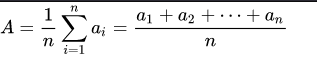
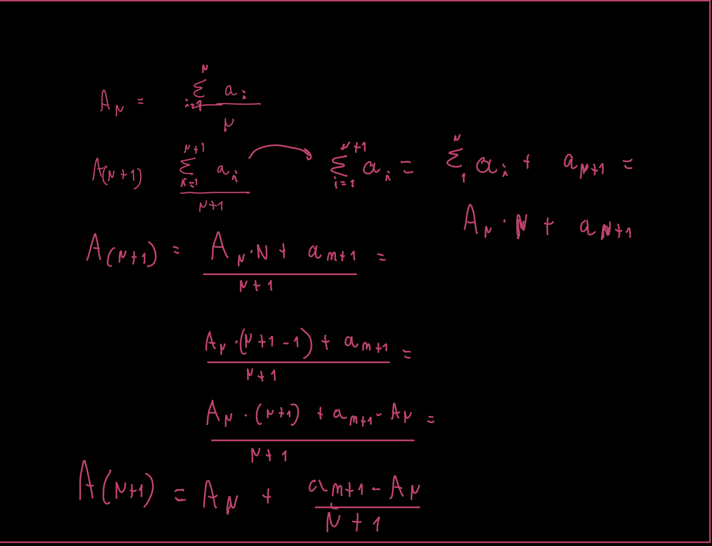

+++
title = "3_R"
date = 2021-10-05T20:03:36+02:00
description = "description why the naive algo for the arithmetic mean is the best options"

draft = false
toc = false
categories = ["statistic"]
tags = ["after", "statistic"]
images = [
  "https://source.unsplash.com/collection/983219/1600x900"
] # overrides site-wide open graph image

[[resources]]
  src = "images/2.png"
  name = "header thumbnail"

+++

## 3_R assignament

### Request
 Show how we can obtain an online algo for the arithmetic mean and explain the various possible reasons why it is preferable to the "naive" algo based on the definition.

## Arithmetic mean standard:
The aritmetic Mean or simply the average is the sum of a collection of numbers divided by the count of numbers in the collection [1].

The formuala that we usually use for the calculation is this: 

### Limitation 
If we are computing the arithmetic mean of  dataset variables(statistic attribute), moreover if we do this in an interactive way(online) or for any kind of computational circumstance that involves this calculus, the classical formula doesn't work very well since we have to fully keep all the value and then do the operation, this could bring to some error such as (but not limited to) segmentation fault, invalid pointer or stack overflow.

## Intercative way 
For remove the formula limitiation try to elaborate it in a different way:
if we have only one element a1 the a.m "A" is = a1 this is our basic step. 
then let's try to compute the algorithm for n value :

So now we have an algo that is perfect for us, we can calculate the mean at each step and update it when other data is present;
using this formula we  resolve the issue of keep in memory a lot of values and  perform arithmetic that could goes outside the 
bounds of the used variables

[1] Jacobs, Harold R. (1994). Mathematics: A Human Endeavor (Third ed.). W. H. Freeman. 
