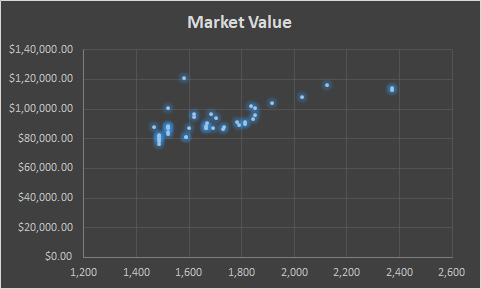
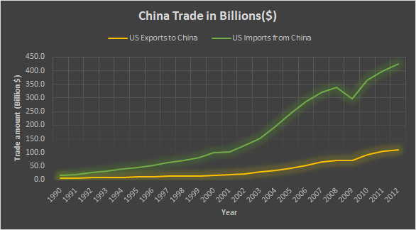
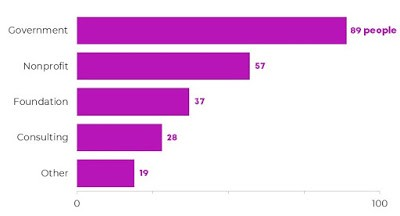
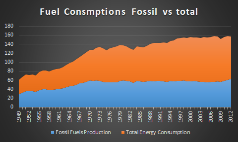
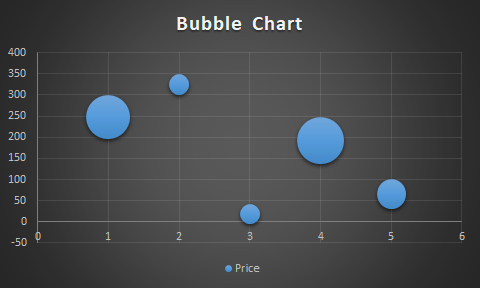
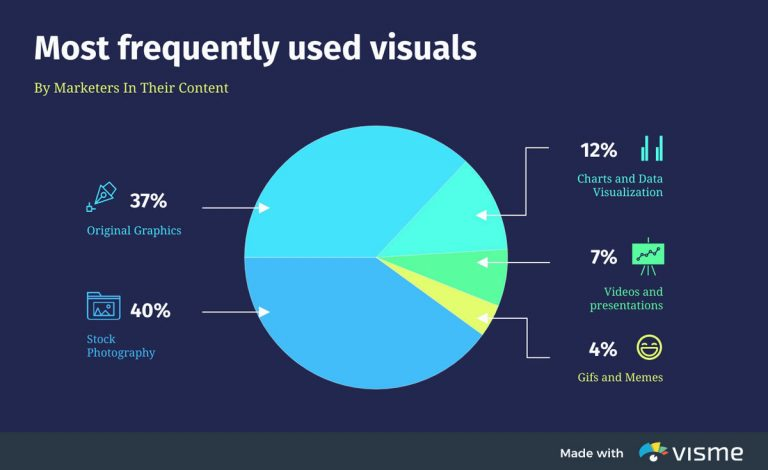
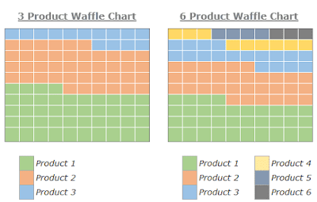
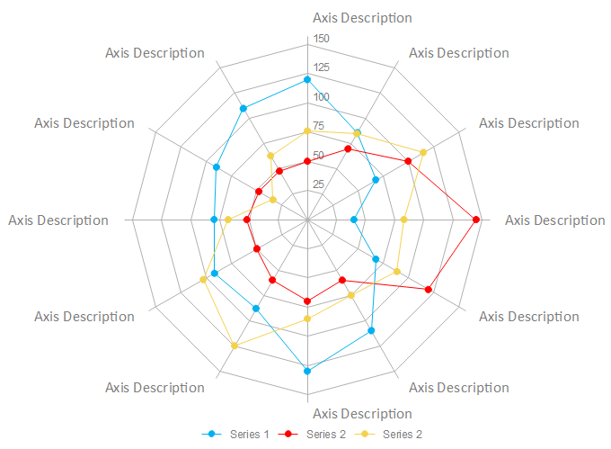
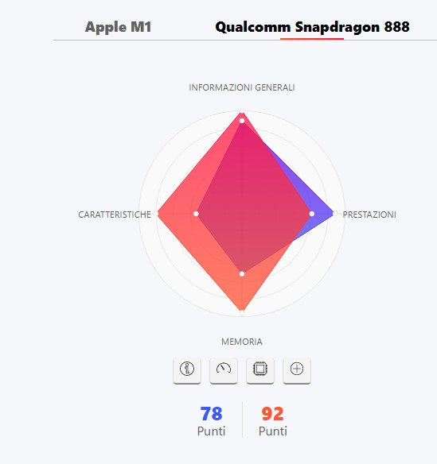

+++
title = "2_RA"
date = 2021-10-05T20:03:36+02:00
description = "Useful charts"

draft = false
toc = false
categories = ["statistic"]
tags = ["after", "statistic"]
images = [
  "https://source.unsplash.com/collection/983219/1600x900"
] # overrides site-wide open graph image

[[resources]]
  src = "images/1.jpg"
  name = "header thumbnail"

+++

## 2_RA assignament

### Request
Do a review about charts useful for statistics and data presentation. What is the chart type that impressed you most and why ?

### Scatterplot 
Very usefull when you want to show relationship between two continus variables:
make correlation between variabliles easy visible.[1]

### Line Plot or Line Chart
The line chart provides a meaningful comparison between two or more than two series,is also very useful in visualzing time series data or data changes over time,is the classical chart for market data:
 

### Column Chart or Vertical Bar Chart
This is  by far the most common chart, useful when comparing categorical or ordinal data, for illustrate distribution and for showing proportions or percentages of a whole.

 

### Horizontal Bar Chart
Same as before but flipped, very easy to read useful for presentation 
 

 ### Area Chart 
 [2]Area chart combines Pie chart and Line chart features, and is one of the graph that provide most info, it's possible to combine more series to make comparison:

 

 ### Bubble Chart
 Make possible to display 3-dimensional data in 2 dimension
 infact the size of the bubble defines the value of the third dimension

 

 ### Pie Chart
 Very useful when we need to understand the relative proportion of each value in a data distribution,anyway data could be difficult to understand[1] 

 

### Waffle Chart or Square Pie Chart
Usefull to get an high level view of contribution to a whole, used also for example by git hub to show per day contributions 

### Spider Charts (Personal Favorite )
To visually compare three or more quantitative variables,the best option is to use a radar chart, also known as a spider or star chart.
The chart usually consists of a series of radii, each representing a different category, that splay out from a center point like spokes.[2]
The length of each “spoke” is proportionate to the value being compared. For each category, the spokes are then connected with a line of a designated pattern or color, forming a star-like shape with points equal to the number of categories.

#### Why i choose this ?

This chart can do comparison between various  attribute at the same time and remain easy to understand and  eye-catching, is very used and usefull for exemple in benchmarking and performance analysis

[1] url:"https://medium.com/analytics-vidhya/top-10-most-useful-charts-in-data-visualization-a4c9365d03e4"
[2] url:"https://visme.co/blog/types-of-graphs/"