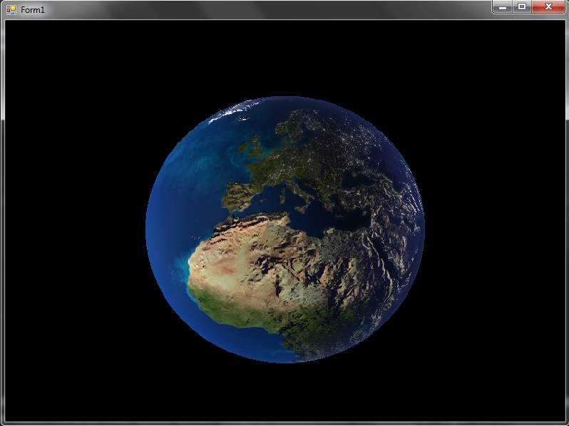
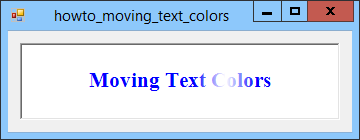

+++
title = "3_RA"
date = 2021-10-05T20:03:36+02:00
description = "Comprehensive research about the GRAPHICS object and all its members"

draft = false
toc = false
categories = ["statistic"]
tags = ["after", "statistic"]
images = [
  "https://source.unsplash.com/collection/983219/1600x900"
] # overrides site-wide open graph image

[[resources]]
  src = "images/2.png"
  name = "header thumbnail"

+++

## 3_RA assignament

### Request
Do a comprehensive research about the GRAPHICS object and all its members (to get ready to create any statistical chart.)

### How we have used Graphics

Usualy in our project we use the graphics class associated with a Bitmap(attached to an image box ) ,the Graphics class infact provides methods for drawing objects to the display device,also remember that  Graphics is associated with a specific device context.[1]It's basic mean is to draw object in the graphical context were is assigned
### Draw 
We can draw many different shapes and lines by using a Graphics object anc calling his methods(these methods include DrawLine, DrawArc, DrawClosedCurve, DrawPolygon,DrawElipse and DrawRectangle),we can for sure starting from this create more complex method to draw for example meaningfull charts or 3d graphics,or 2D graphics, in fact we could also see the graphics class as our API to .NET Graphical engine.

## Text writing 
For sure we can also arrange text on the screen using graphics,selecting his size font and brushes using the DrowsString method es:
DrawString("yourText", new Font("Tahoma",8), Brushes.Black, rectf);

[1]"url":"https://docs.microsoft.com/en-us/dotnet/api/system.drawing.graphics?view=windowsdesktop-5.0#methods"