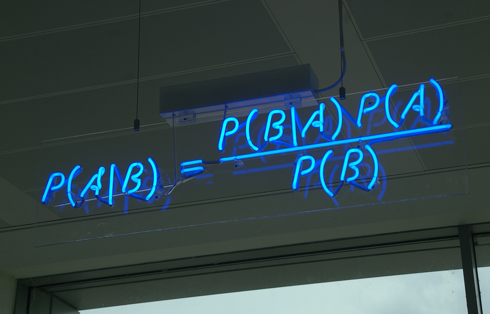

+++
title = "4_R"
date = 2021-10-05T20:03:36+02:00
description = "Explain what are marginal, joint and conditional distributions and how we can explain the Bayes theorem using relative frequencies."

draft = false
toc = false
categories = ["statistic"]
tags = ["after", "statistic"]
images = [
  "https://source.unsplash.com/collection/983219/1600x900"
] # overrides site-wide open graph image

[[resources]]
  src = "images/1.jpg"
  name = "header thumbnail"

+++

## 4_R assignament

### Request

 Explain what are marginal, joint and conditional distributions and how we can explain the Bayes theorem using relative frequencies. Explain the concept of statistical independence and why, in case of independence, the relative joint frequencies are equal to the products of the corresponding marginal frequencies.
 
 
 ### Margianal 
 Are the distributions that we find on the margin of the bivariate distribution matrix, describes the frequenceis in wich one variabiles has a certain value without restriction on the value of the other
 ### Conditional ditribution
 Are the distribution that we find on a row or on a column of the bivariate distribution matrix, describes the frequenceis in which one variabiles has a certain value taken the other fixed

 ### Joint distribution 
 Describes the frequency in which a particular values for both the variable appear. 

 ## Bayes theorem and realtive frequencies
 Bayes theorem talk about probability but relative frequency are nothing more than "experimental" probability  so we can use it to better understand the theorem and explain it, in fact from the matrix we can calculate all the conditional probability,for example: 
  - we have two dice x,y one with 6 face x and the other with 8
  - we do a lot of random tentative 
  -  what are the probabilty of 3 on x given y=6
   
   | X/Y 	| 1   	| 2   	| 3   	| 4   	| 5   	| 6   	| 7   	| 8   	|
|-----	|-----	|-----	|-----	|-----	|-----	|-----	|-----	|-----	|
| 1   	| 100 	| 100 	| 100 	| 100 	| 100 	| 100 	| 100 	| 100 	|
| 2   	| 100 	| 100 	| 100 	| 100 	| 100 	| 100 	| 100 	| 100 	|
| 3   	| 100 	| 100 	| 100 	| 100 	| 100 	| 100 	| 100 	| 100 	|
| 4   	| 100 	| 100 	| 100 	| 100 	| 100 	| 100 	| 100 	| 100 	|
| 5   	| 100 	| 100 	| 100 	| 100 	| 100 	| 100 	| 100 	| 100 	|
| 6   	| 100 	| 100 	| 100 	| 100 	| 100 	| 100 	| 100 	| 100 	|

- For finding this  (p(A\B)= p(x=3\y=6)) we look at the table and see that there is 100 in the column x=3, row y=6 point 
so the probababilty of this event will be of 100/ on something and in this case something is all the throwing when y=6 that are 600.

So the probabyity is  1/6,but what about the inverse case?
lets' invert the case
1.we are on the same point as before but whe need to divide for the total case when x=3 insted as what we have done before.
- So 100/800=1/8;

now let's  consider  P(X=3)= 1/(all the possible value of x )=1/6 and so P(y=6) is 1/8
- we have that the frist result P(x=3/y=6)=1/6
- and the second result that is 1/8
- we can easy spot that:
- 1/6=(1/8 * 1/6)/1/1/8
- bring it to the formula
- P(x=3\y=6)=(P(y=6/x=3)*P(x=3))/P(y=6)
- and in general  the Bayes theorem:
- P(A\B)=(P(B/A)*P(A))/P(B) 

## Statistical independence 
We have statistical independence between two variables  when there is no correleation between the variables and so the probability(frequency) that an avent occur given another is the same as the probability that that event occur.
in the bivariant matrix this mean that we have the same distrbution of frequency, in evry row and in the margin,or in evry column and the margin, and so we could say that the relative joint frequencies are equal to the products of the corresponding marginal frequencies.
 

 [1]"url":"[Teorema_di_Bayes](https://it.wikipedia.org/wiki/Teorema_di_Bayes)"