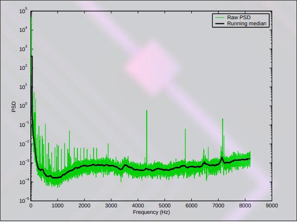

+++
title = "6_RA"
date = 2021-10-28T20:03:36+02:00
description = "Do a web research about the various methods proposed to compute the running median"

draft = false
toc = false
categories = ["statistic"]
tags = ["after", "statistic"]
images = [
  "https://source.unsplash.com/collection/983219/1600x900"
] # overrides site-wide open graph image

[[resources]]
  src = "images/1.jpg"
  name = "header thumbnail"

+++

## 6_RA assignament

### Request
Do a web research about the various methods proposed to compute the running median (one pass, online algorithms).
Store (cite all sources and attributions) the algorithm(s) that you think is(are) a good candidate, explaining briefly how it works and possibly try a quick demo.

### Compute it with one pass
the median is the value that is at the center of the distribution and  biscet it,for computing it we can use a simple algo:
Starting from a ordered distribution  (cardinality n) whe could say that:
- if the number of value are odd we can take the value placed at (n+1)/2 as the median
- if the number of value is even we take the two value in the middle (at index n/2 and n/2+1) and compute the mean between the two value as the median

### how to calculate it with an oline algo 
we can approssimate the median with the formula: [1] 
Me= Xi+(Xi+1 -Xi)=(0,5 -Fi)/(Fi+1-Fi)
where Fi are the acutual comulative frequency
and calculate it online with this 

### Efficient Algorithm for computing a Running Median
From -LIGO- LASER INTERFEROMETER GRAVITATIONAL WAVE OBSERVATORY[2]

Inputs to the code:
• X : the sequence x[k], k = 0, . . . , N − 1.
• M : The number of points per block.
Output of the code:
• Y : sequence y[k], k = 0, . . . , N − M.
* 1 Sort the first M samples x[k], k = 0, . . . , M −1, in ascending order. The ANSI C <stdlib.h> library comes with
a routine for sorting called qsort which can be used for this first step. Let the sorted list, in ascending order, be
Z[k], k = 0, . . . , M − 1. Thus, Z[0] ≤ Z[1] ≤ Z[2] . . . ≤ Z[M − 1].
* 2 Load the sorted samples into the nodes of a linked list [6] with each node containing one sample. Each node of
the linked list has three types of links to other nodes.
Sequential link If the current node has sample x[p], then this link points to the node containing x[p + 1].
Next Sorted link If the current node has sample Z[p], then this link points to the node containing Z[p + 1].
Previous Sorted link If the current node has sample Z[p], then this link points to the node containing Z[p−1].
In the qsort algorithm, the ordering of equal samples is arbitrary and so is it assumed here.
* 3 Set up an array, checks[ ], of pointers to nodes of the linked list such that checks[n] points to the node
containing Z
h
n ∗ floor ³√
M
´i. The special nodes pointed to by elements of checks[ ] are called checkpoints
in the following. Further denote the samples contained in checkpoint p by C[p] = Z
h
p ∗ floor ³√
M
´i, p =
0, . . . , floor(√
M) − 1.
Why are the checkpoints spaced √
M samples apart? Once one obtains a sorted block of M samples, the
sequentially next sample outside this block must be placed in the sorted list and the sequentially first sample
in the block must be deleted. This is done by first comparing the new sample sequentially against the samples
4
in checkpoints. Once the checkpoints that bracket the new sample are found, comparisons are made with only
the samples within this bracket to locate the exact position of the new sample in the sorted list. This implies
that in the worst case P comparison operations are needed, if P is the number of checkpoints used, to find the
bracketing checkpoints. After this one may have to make M/P further comparisons to locate the exact position
of the new sample in the ordered list. Thus the total operation count K, in the worst case, is
K = P + M/P . (2)
The value of P which minimises K is P =
√
M. This is why checkpoints are spaced M/P = M/√
M =
√
M
samples apart in this algorithm.
* 4 Find the element n0 of checks[ ] such that the sample in the corresponding node is nearest to the node containing
the median (for M odd) or the first member of the pair which needs to be averaged (for M even). This element
will provide a fast access to the node containing the samples needed to compute the median. This is necessary
because we are dealing with a linked list and not an array that can be randomly accessed.
* 5 FOR j = M TO N − 1 DO

  - (a) Get sample x[j].
  - (b) Locate the element pj of checks such that C[pj ] ≤ x[j] < C[pj + 1].
  - (c) Start from the node checks[pj ] and follow the Next Sorted link until a node is found such that the sample
value h it contains satisfies x[j] ≤ h. We have thus found the exact place where the new sample x[j] must
be inserted.
The next few steps find out the checkpoints that are bracketed by x[j] and the sample to be deleted,
x[j − M]. When the corresponding nodes are respectively inserted and deleted from the list, the bracketed
checlpoints must be shifted to adjacent nodes.
  - (d) Consider the node containing the first element of the sequential list. That sample will be x[j − M].
  - (e) Find elements q and p of checks such that
i. If x[j − M] < x[j]
x(j − M) < C[q] < . . . < C[p] < x[j]
ii. else if x[j − M] > x[j]
x[j] < C[p + 1] < . . . < C[q] < x[j − M].
iii. else if x[j − M] == x[j]
Do nothing. No shifting of checkpoints required since in this case all samples in the sorted list between
x[j] and x[j − M] must be equal to x[j] = x[j − M].
  - (f) Shift the checkpoints found in step 5e.
i. If x[j − M] < x[j]
Shift each pointer checks[k], k ∈ [q, p], to point to the next right node (i.e., higher in sorted order).
ii. Else
shift to the next left node.
  - (g) Delete node containing x[j − M] from the linked list (repair the links between the nodes adjacent to it).
  - (h) Rewrite the data in this node by x[j].
  - (i) Insert this node before the node containing h.
  - (j) Follow Next Sorted link from checks[n0] to get the median value.
* 6 END DO

Several special cases may arise such as x[j] smaller or larger than any of the sample from the previous block. A lot
of the code is devoted to handling such special cases. 

[1]"url","https://dcc-backup.ligo.org/public/0027/T030168/000/T030168-00.pdf"
[2]"url","https://it.wikipedia.org/wiki/Mediana_(statistica)#Definizione_e_calcolo"
