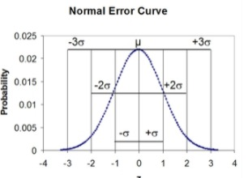

+++
title = "9_R"
date = 2021-10-28T20:03:36+02:00
description = "History and derivation of the normal distribution"

draft = false
toc = false
categories = ["statistic"]
tags = ["after", "statistic"]
images = [
  "https://source.unsplash.com/collection/983219/1600x900"
] # overrides site-wide open graph image

[[resources]]
  src = "images/2.png"
  name = "header thumbnail"

+++

## 9_R assignament

### Request
History and derivation of the normal distribution. Touch, at least, the following three  important perspectives, putting them into an historical context to understand how  the idea developed:

1) as approximation of binomial (De Moivre)
2) as error curve (Gauss)
3) as limit of sum of independent r.v.'s (Laplace)





### The normal distribution as approximation of binomial
Historically, being able to compute binomial probabilities was one of the most important applications of the central limit theorem. Binomial probabilities with a small value for  n (say, 20) were displayed in a table in a book. To calculate the probabilities with large values of  n , you had to use the binomial formula, which could be very complicated. Using the normal approximation to the binomial distribution simplified the process. To compute the normal approximation to the binomial distribution, take a simple random sample from a population. You must meet the conditions for a binomial distribution:

- there are a certain number  n  of independent trials
- the outcomes of any trial are success or failure
- each trial has the same probability of a success  p 
Recall that if  X  is the binomial random variable, then  X∼B(n,p) . The shape of the binomial distribution needs to be similar to the shape of the normal distribution. To ensure this, the quantities  np  and  nq  must both be greater than five ( np>5  and  nq>5 ); the approximation is better if they are both greater than or equal to 10). Then the binomial can be approximated by the normal distribution with mean  μ=np  and standard deviation  σ=√(npq) . Remember that  q=1−p . In order to get the best approximation, add 0.5 to  x  or subtract 0.5 from  x  (use  x+0.5  or  x−0.5 ). The number 0.5 is called the continuity correction factor[1]

### As error Curve (Gauss)
The normal distribution is also called Gaussian distribution in refers to Carl Friedrich Gauss, who first developed a two-parameter exponential function in 1809 in connection with studies of astronomical observation errors.This study led Gauss to formulate his law of observational error and to advance the theory of the method of least squares approximation.[4]

When  we look at a standardized Gaussian distribution in  the so-called Normal Error Curve  you can see that the probability of any one measurement being a member of this particular distribution increases as the magnitude of z increases.[2]

### as limit of sum of independent r.v.'s (Laplace)
Laplace’s theorem states that if the error curve of a single observation is symmetric, then the error curve of the sum of several observations is indeed approximated by one of the Gaussian curves we have see before[3]. Hence if we take the further step of imagining that the error involved in an individual observation is the aggregate of a large number of “elementary” or “atomic” errors, then this theorem predicts that
the random error that occurs in that individual observation is indeed controlled by De
Moivre and Gauss’s curve, we call this the hypothesis of elementary errors

### Beyond errors

The first mathematician to extend the provenance of the normal distribution beyond
the distribution of measurement errors was Adolphe Quetelet (1796–1874). He began
his career as an astronomer but then moved on to the social sciences. Consequently,
he possessed an unusual combination of qualifications that placed him in just the right
position for him to be able to make one of the most influential scientific observations
of all times.
He made in fact an analysis on the chest size of the Scottish soliders: 

| Girth | Frequency |
|-------|-----------|
| 33    | 3         |
| 34    | 18        |
| 35    | 81        |
| 36    | 185       |
| 37    | 420       |
| 38    | 749       |
| 39    | 1,073     |
| 40    | 1,079     |
| 41    | 934       |
| 42    | 658       |
| 43    | 370       |
| 44    | 92        |
| 45    | 50        |
| 46    | 21        |
| 47    | 4         |
| 48    | 1         |

With this analysis he find out  that the pattern followed by the variety of
its chest measurements was identical with that formed by the type of repeated measurements that are common in astronomy. 
In modern terminology, Quetelet claimed that the chest measurements were normally distributed!

[1]"url","https://stats.libretexts.org/Courses/Las_Positas_College/Math_40%3A_Statistics_and_Probability/06%3A_Continuous_Random_Variables_and_the_Normal_Distribution/6.04%3A_Normal_Approximatio### n_to_the_Binomial_Distribution"
[2]"url","https://chem.libretexts.org/Bookshelves/Analytical_Chemistry/Supplemental_Modules_(Analytical_Chemistry)/Analytical_Sciences_Digital_Library/JASDL/Courseware/Introduction_to_Signals_and_Noise/02_Signals_and_Noise/04_Normal_Error_Curve"
[3]"url","https://www.maa.org/sites/default/files/pdf/upload_library/22/Allendoerfer/stahl96.pdf"

[4]"From Abraham De Moivre to Johann Carl Friedrich Gauss","http://www.ijesi.org/papers/Vol(7)i6/Version-5/D0706052834.pdf"
