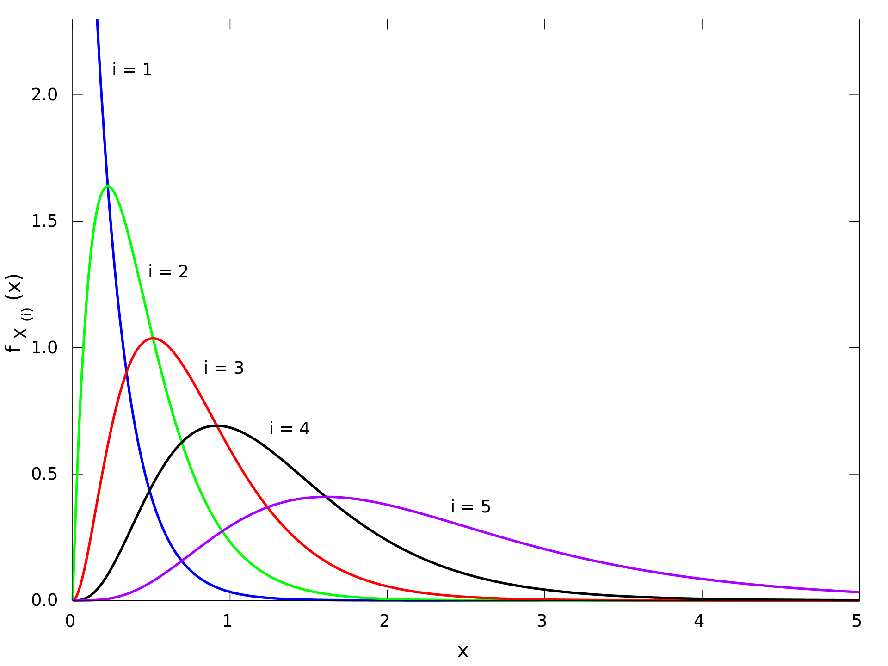
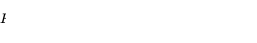
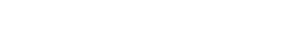
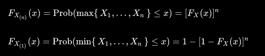

+++
title = "10_R"
date = 2021-11-05T20:03:36+02:00
description = "Distributions of the order statistics"
math=true
draft = false
toc = false
categories = ["statistic"]
tags = ["after", "statistic"]
images = [
  "https://source.unsplash.com/collection/983219/1600x900"
] # overrides site-wide open graph image

[[resources]]
  src = "images/2.png"
  name = "header thumbnail"

+++

## 10_R assignament

### Request
Distributions of the order statistics: look on the web for the most simple (but still rigorous) and clear derivations of the distributions, explaining in your own words the methods used.

### Order statistics

Together with rank statistics, order statistics are among the most fundamental tools in non-parametric statistics and inference.
In statistics we define  the kth order statistic of a statistical sample as  its kth-smallest value.[1]

Important special cases of the order statistics are the minimum and maximum value of a sample, and the sample median and other sample quantiles.

When using probability theory to analyze order statistics of random samples from a continuous distribution, the cumulative distribution function is used to reduce the analysis to the case of order statistics of the uniform distribution.

Probability density functions of the order statistics for a sample of size n = 5 from an exponential distribution with unit scale parameter

### Distributions function of order statistic

For a random sample as above, with cumulative distribution Fx(x), the order statistics for that sample have cumulative distributions as follows (where r specifies which order statistic): 

the corresponding probability density function may be derived from this result, and is found to be:

Moreover, there are two special cases, which have CDFs which are easy to compute.

Which can be derived by careful consideration of probabilities.

[1]"url","https://en.wikipedia.org/wiki/Order_statistic"
