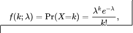

+++
title = "8_RA"
date = 2021-11-05T20:03:36+02:00
description = "Find out on the web what you have just generated in the previous application"

draft = false
toc = false
categories = ["statistic"]
tags = ["after", "statistic"]
images = [
  "https://source.unsplash.com/collection/983219/1600x900"
] # overrides site-wide open graph image

[[resources]]
  src = "images/1.jpg"
  name = "header thumbnail"

+++

## 8_RA assignament

### Request
Find out on the web what you have just generated in the previous application. Can you find out about all the well known distributions that "naturally arise" in this process ?
 
 
### The Poisson distribution
When in the 11A we calculate the single and double jump we find out ones of the most important distribution of statistic the Possion distribution, in fact the poisson distribution express the probability that a certain number of independent event happen.

### The Poisson process 
A Poisson process is a simple and widely used stochastic process for modeling the times at which arrivals enter a system.
For the Poisson process, arrivals may occur at arbitrary positive times, and the probability
of an arrival at any particular instant is 0. This means that there is no very clean way of
describing a Poisson process in terms of the probability of an arrival at any given instant. It
is more convenient infact to define a Poisson process in terms of the sequence of interarrival times[2]
#### Arrival process
Is a sequence of sums of interarrival times 0<S1<S2 each ones callaed arrival epochs and represent the times at wich some repeting event occurs.

### Definition of the Poisson process
The resulting random process is called a Poisson process with rate (or intensity) λ. Here is a formal definition of the Poisson process.

Let λ>0 be fixed. The counting process {N(t),t∈[0,∞)} is called a Poisson process with rates λ if all the following conditions hold:
- N(0)=0;
- N(t) has independent increments;
- the number of arrivals in any interval of length τ>0 has Poisson(λτ) distribution.

### Poisson Distributions
A discrete random variable X is said to have a Poisson distribution, with parameter λ>0 if it has a probability mass function given by:

here:
- k is the number of occurrences (k=0,1,2...) 
-  e is Euler's number ( e=2.71828...)
- ! is the factorial function.

[1]"url","https://www.probabilitycourse.com/chapter11/11_1_2_basic_concepts_of_the_poisson_process.phpk"
[2]"url"https://ocw.mit.edu/courses/electrical-engineering-and-computer-science/6-262-discrete-stochastic-processes-spring-2011/course-notes/MIT6_262S11_chap02.pdf"
[3]"url","https://towardsdatascience.com/the-poisson-distribution-and-poisson-process-explained-4e2cb17d459"
[4]"url","https://en.wikipedia.org/wiki/Poisson_distributiohttps://en.wikipedia.org/wiki/Poisson_distributionn"
