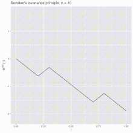
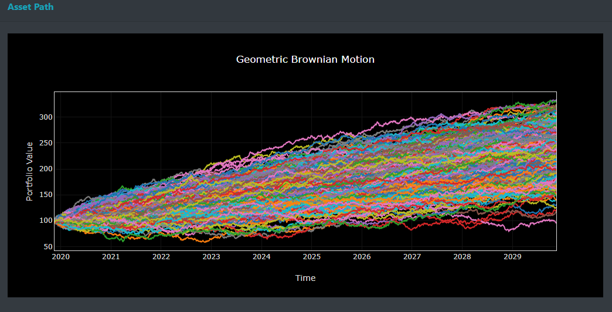

+++
title = "13_R"
date = 2021-11-05T20:03:36+02:00
description = "An analog of the CLT for stochastic process"
katex=true
draft = false
toc = false
categories = ["statistic"]
tags = ["after", "statistic"]
images = [
  "https://source.unsplash.com/collection/983219/1600x900"
] # overrides site-wide open graph image

[[resources]]
  src = "images/2.png"
  name = "header thumbnail"

+++

## 13_R assignament

### Request
An "analog" of the CLT for stochastic process: the standard Wiener process as "scaling limit" of a random walk and the functional CLT (Donsker theorem) or invariance principle. Explain the intuitive meaning of this result and how you have already illustrated the result in your homework. 

### Donsker’s theorem

In probability theory, Donsker’s theorem (also known as Donsker’s invariance principle, or the functional central limit theorem), named after Monroe D. Donsker, is a functional extension of the central limit theorem.[1
]

Let X1,X2,X3... be a sequence of independent and identically distributed random variables with mean 0 and variance 1. and lets take  S:= (Sn) where Sn is the sum of all Xi

The stochastic process S  is known as a  random walk.
Define the diffusively rescaled random walk (partial-sum process) by:

The central limit theorem asserts that W^(n)(1) converges in distribution to a standard Gaussian random variable W(1) when n -> ∞.

Donsker’s invariance principle extends this convergence to the whole function W^(n):=hj(W^(n)(t) with t in 0,1

So Donkers's theorem states that  as random varabile taken values in a Skorokhod space the random function W^(n) converges in distribution to a standard Brownian motion for  n -> ∞.(Donsker's invariance principle).
This concept is used among the other field  for assets price inference 

[1]"url","https://en.wikipedia.org/wiki/Donsker%27s_theorem "

