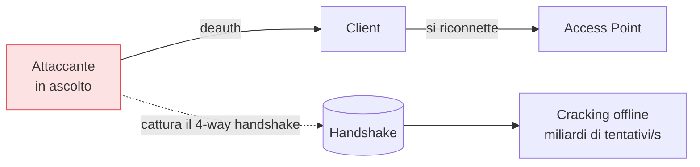

## Perché conta

La rete Wi-Fi è l'unico mezzo trasmissivo che chiunque, dal parcheggio, può ascoltare senza
collegare un cavo. Per vent'anni la protezione è stata WPA2, solido ma con due debolezze diventate
celebri: l'attacco **KRACK** del 2017 e, soprattutto, la possibilità di catturare l'handshake e
provare le password **offline**, senza limiti di velocità. WPA3, obbligatorio nei dispositivi
certificati Wi-Fi 6, cambia proprio queste regole.

## Il problema di WPA2: l'handshake catturabile

In WPA2-Personal la chiave di sessione deriva dalla password condivisa tramite un handshake a 4 vie.
Un attaccante non ha bisogno della password per catturare l'handshake: gli basta ascoltare un
client che si connette (o forzarne la riconnessione con un frame di deautenticazione). Poi, offline,
prova miliardi di password al secondo contro quella cattura.



Il tempo per rompere una password dipende solo dalla sua entropia. Con un alfabeto di dimensione
$N$ e lunghezza $L$, lo spazio da provare è:

$$
S = N^{L}
$$

Una password di 8 caratteri minuscoli ($N=26$, $L=8$) ha circa $2 \times 10^{11}$ combinazioni:
poche ore per hardware moderno. È per questo che in WPA2 la sicurezza dipende interamente dalla
forza della password.

## Cosa cambia con WPA3: SAE

WPA3-Personal sostituisce l'handshake con **SAE (Simultaneous Authentication of Equals)**, basato
sullo scambio Dragonfly. La differenza chiave: SAE è un **PAKE** (Password-Authenticated Key
Exchange). La password non viene più usata in un modo che permetta di verificarla offline su una
cattura passiva.

Conseguenze pratiche:

- **Niente cracking offline**: catturare lo scambio SAE non dà all'attaccante nulla da attaccare
  offline. Ogni tentativo richiede una **nuova interazione** con l'access point, che può essere
  limitata (rate limiting) e rilevata.
- **Forward secrecy**: ogni sessione usa una chiave fresca. Rubare la password domani non decifra
  il traffico catturato oggi.
- **Protezione anche con password deboli**: non è un invito a usarle, ma una password mediocre non
  crolla più in poche ore come in WPA2.

## Protected Management Frames

WPA3 rende obbligatori i **Protected Management Frames (PMF, 802.11w)**. I frame di gestione — tra
cui la deautenticazione — sono ora autenticati. L'attacco di deauth che forzava la riconnessione
(il primo passo dello schema qui sopra) non funziona più: l'access point ignora i frame di deauth
falsificati.

## La configurazione (hostapd)

Su un access point Linux con `hostapd`:

```text {hl_lines=[2,3,5]}
# WPA3-Personal
wpa=2
wpa_key_mgmt=SAE                 # SAE invece di WPA-PSK
ieee80211w=2                     # PMF obbligatorio
sae_require_mfp=1                # SAE richiede i frame di gestione protetti
rsn_pairwise=CCMP
```

Le righe evidenziate attivano SAE (`wpa_key_mgmt=SAE`) e rendono obbligatorio PMF (`ieee80211w=2`),
i due pilastri di WPA3.

### Modalità di transizione

Molti dispositivi vecchi non parlano WPA3. La **transition mode** (`wpa_key_mgmt=WPA-PSK SAE`)
permette a client WPA2 e WPA3 di coesistere. Ma attenzione: in questa modalità un attaccante può
tentare un **downgrade**, forzando il client a usare WPA2 e riaprendo il cracking offline. La
transizione è un compromesso per la compatibilità, non una configurazione pienamente sicura: dove
possibile, SAE puro.

## Lab

Con una scheda Wi-Fi che supporta AP mode e `hostapd`:

1. Configurate un AP in WPA2-PSK e uno in WPA3-SAE.
2. In WPA2, catturate un handshake (`airodump-ng`) e osservate che è acquisibile offline.
3. In WPA3-SAE, verificate che lo stesso approccio non produce materiale attaccabile offline.
4. Provate un frame di deauth con PMF attivo: l'AP deve ignorarlo.


<details>
<summary><strong>Domanda:</strong> se WPA3 protegge anche le password deboli, serve ancora una password lunga?</summary>
<p>Sì. SAE elimina il cracking <em>offline</em>, ma non l'attacco <em>online</em>: un attaccante può
ancora provare password contro l'access point, un tentativo alla volta, interagendo con lui. È molto
più lento e rilevabile (e limitabile con rate limiting), ma una password banale come "password1"
cadrebbe comunque in un attacco a dizionario online. WPA3 alza enormemente il costo dell'attacco, non
lo azzera: una password lunga e casuale resta la base. La differenza è che con WPA2 anche una password
discreta cadeva offline, con WPA3 solo quelle davvero deboli cadono, e solo online.</p>
</details>


## Conclusione

WPA3 non è un ritocco di WPA2: cambia il modello di attacco. SAE toglie il cracking offline degli
handshake, la forward secrecy protegge il traffico passato, PMF chiude gli attacchi di deauth. Il
punto debole residuo è la modalità di transizione, dove il downgrade a WPA2 riapre i vecchi
problemi. Dove i dispositivi lo permettono, SAE puro; e, come sempre, una password robusta.
