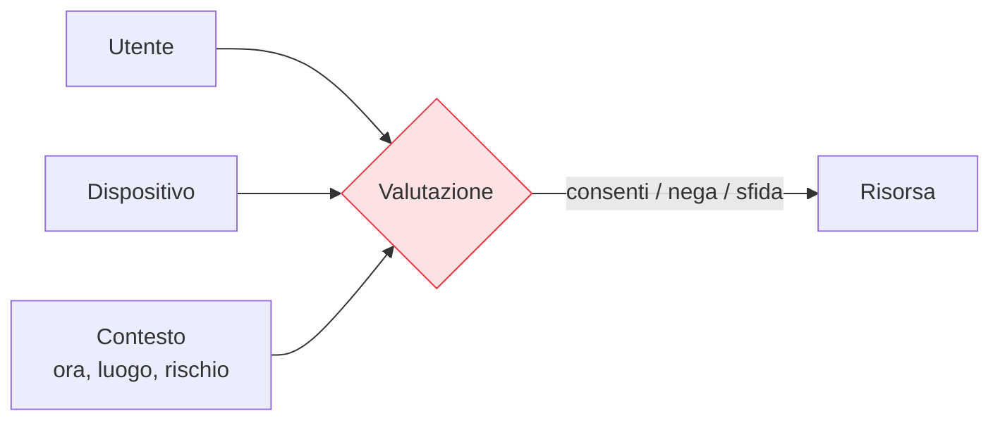

## Perché conta

Prima di configurare qualunque cosa, bisogna sapere cosa stiamo costruendo. Lo Zero Trust è spesso
venduto come un prodotto da installare; in realtà è un insieme di **principi** che guidano le
decisioni di architettura. Se non si parte dai principi, si finisce per comprare un firewall nuovo e
chiamarlo "Zero Trust". Questo capitolo distilla i tenets del [NIST 800-207]()
in cinque principi operativi, il metro con cui giudicare ogni scelta successiva della serie.

## 1. Non fidarsi mai, verificare sempre

Il principio fondante. Nessuna richiesta è fidata per la sua **origine**: non perché viene da dentro
la rete, non perché l'utente si è già autenticato un'ora fa. Ogni accesso a ogni risorsa è verificato
nel momento in cui avviene. Il contrario del modello tradizionale, dove entrare nel perimetro
equivaleva a essere fidati (vedi [Oltre il perimetro]()).

## 2. Verifica esplicita

La verifica usa **tutti** i segnali disponibili, non solo la password: identità dell'utente,
identità e postura del dispositivo, posizione, ora, comportamento, sensibilità della risorsa. La
decisione è il risultato di una valutazione, non di un singolo fattore.

## 3. Minimo privilegio

Ogni identità ottiene **solo** l'accesso che le serve, per il tempo che le serve. Niente permessi
"nel caso serva". Si declina in accesso Just-in-Time e Just-enough-access (cap. 10): i privilegi
sono concessi al momento e revocati subito dopo. Riduce la superficie che un account compromesso può
toccare.

## 4. Assumere la breccia

Si progetta **come se l'attaccante fosse già dentro**. Questo cambia tutto: si cifra il traffico
interno, si segmenta la rete fino al singolo workload
([microsegmentazione]()), si limita il
movimento laterale, si registra e si analizza tutto. Non si spera di tenere fuori l'attaccante: si
limita il danno di quando entra.

## 5. Verifica continua

L'accesso non è un cancello che si apre una volta, ma una condizione che si rivaluta nel tempo. Se
il rischio cambia — il dispositivo perde la conformità, il comportamento diventa anomalo — l'accesso
si restringe o si revoca, senza aspettare il prossimo login (cap. 15).

## Il metro: prodotto o architettura?

Questi principi sono il filtro per smascherare il marketing. Una domanda sola:

| Afferma... | È Zero Trust se... |
|---|---|
| "VPN Zero Trust" | autentica per-risorsa e verifica la postura, non dà accesso di rete piatto |
| "Firewall Zero Trust" | applica policy per identità, non solo per IP/porta |
| "MFA = Zero Trust" | è un pezzo (verifica esplicita), non l'architettura intera |

Nessun singolo prodotto "è" Zero Trust. Lo Zero Trust è come i pezzi lavorano **insieme** attorno a
questi principi.

## Lab

Non c'è da configurare nulla: c'è da valutare. Prendete un accesso reale della vostra rete (es. un
dipendente che apre un gestionale da casa) e mappatelo sui cinque principi:

1. La rete di provenienza conferisce fiducia? (principio 1)
2. Quali segnali oltre la password vengono valutati? (principio 2)
3. L'utente ha più accesso del necessario? (principio 3)
4. Se quel PC fosse compromesso, cosa raggiungerebbe? (principio 4)
5. L'accesso viene rivalutato dopo il login? (principio 5)

Le risposte sono la vostra baseline: i capitoli successivi colmano i divari che emergono.



<strong>Domanda:</strong> se devo verificare ogni accesso con tutti i segnali, lo Zero Trust non rende tutto lento e insopportabile per gli utenti?

È il timore più comune, e la risposta ben fatta è l'opposto. La verifica continua è pensata per
essere <em>invisibile</em> quando il rischio è basso: se identità, dispositivo e contesto sono quelli
soliti, l'utente non vede nulla, nemmeno una richiesta MFA in più (è il senso dell'accesso adattivo
del <a href="/p/verifica-continua-e-accesso-adattivo/">cap. 15</a>). La frizione compare solo quando
qualcosa è anomalo — un dispositivo sconosciuto, una posizione insolita — cioè proprio quando vogliamo
che compaia. Un modello ben disegnato spesso <em>riduce</em> l'attrito rispetto alla VPN classica, che
chiede login e token a ogni connessione a prescindere. Lo Zero Trust fatto male è insopportabile;
fatto bene, è più fluido perché commisura la verifica al rischio reale.



## Conclusione

Cinque principi: verificare sempre, verificare con tutti i segnali, dare il minimo privilegio,
assumere la breccia, rivalutare di continuo. Non sono slogan ma criteri di progetto, e sono il metro
con cui leggere tutto il resto della serie. Nel prossimo capitolo vediamo cosa stiamo lasciando alle
spalle: il modello perimetrale e perché ha smesso di funzionare.
