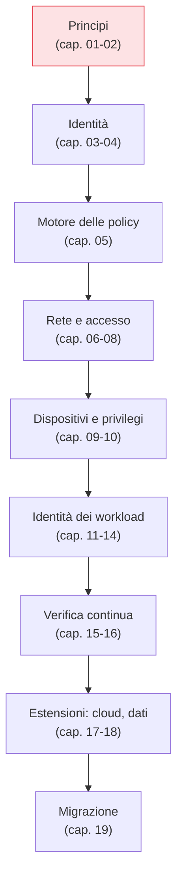

## Perché questa serie

"Zero Trust" è diventato un termine di marketing: ogni prodotto lo promette, pochi lo spiegano. Ma
sotto il rumore c'è un cambiamento di paradigma concreto e verificabile — smettere di fidarsi della
rete e iniziare a verificare ogni accesso, sempre, in base all'identità e al contesto. Questa serie
in 20 capitoli smonta il concetto nei suoi pezzi reali e mostra come si costruisce, con esempi di
configurazione e laboratori riproducibili. È il seguito naturale del post introduttivo
[Zero Trust Architecture]().

## Il filo del discorso

Lo Zero Trust non è un prodotto che si compra, ma un'architettura che si costruisce per strati. La
serie segue questo ordine:

## I capitoli

**Fondamenti**
- 01 — I cinque principi dello Zero Trust (NIST 800-207)
- 02 — Oltre il perimetro: perché il modello castello-e-fossato non basta più

**Identità**
- 03 — L'identità è il nuovo perimetro
- 04 — MFA resistente al phishing (FIDO2/WebAuthn)
- 05 — PDP e PEP: il motore che decide e applica le policy

**Rete e accesso**
- 06 — Microsegmentazione nello Zero Trust
- 07 — ZTNA: l'accesso oltre la VPN
- 08 — SASE e Zero Trust

**Dispositivi e privilegi**
- 09 — Device trust e postura degli endpoint
- 10 — Least privilege e accesso Just-in-Time

**Identità dei workload**
- 11 — L'identità dei workload con mTLS
- 12 — SPIFFE e SPIRE
- 13 — Service mesh e Zero Trust
- 14 — Policy as code con OPA

**Verifica e osservabilità**
- 15 — Verifica continua e accesso adattivo al rischio
- 16 — Telemetria e analytics nello Zero Trust

**Estensioni e percorso**
- 17 — Zero Trust nel cloud
- 18 — Zero Trust per i dati
- 19 — Migrare a Zero Trust: maturità, roadmap, errori comuni

## Per chi è

Per chi progetta o amministra reti e sistemi e vuole capire lo Zero Trust oltre lo slogan: cosa
significa in termini di identità, policy, segmentazione e verifica, e quali strumenti concreti lo
realizzano. Ogni capitolo è autonomo ma costruisce sui precedenti; la lettura in ordine dà il quadro
completo.

## Convenzioni

Ogni capitolo ha una sezione **Perché conta**, lo sviluppo con diagrammi ed esempi, un **Lab**
riproducibile e una domanda scomoda in fondo. Gli esempi privilegiano strumenti open source
(FreeRADIUS, OPA, SPIRE, Istio/Linkerd, Open vSwitch) e ambienti di laboratorio containerlab.

## Conclusione

Lo Zero Trust si capisce costruendolo. Questa serie parte dai principi e arriva alla migrazione,
pezzo per pezzo, senza slogan. Si comincia dal prossimo capitolo: i cinque principi che definiscono
cosa è davvero Zero Trust — e cosa non lo è.
