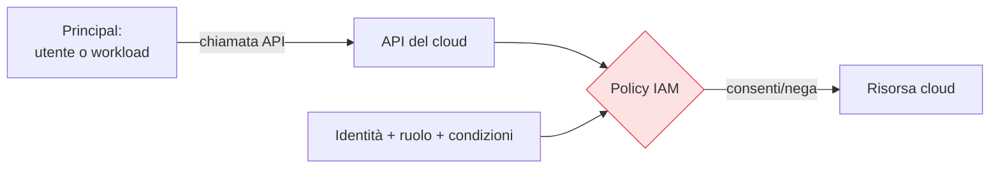

## Perché conta

Il cloud è il contesto dove lo Zero Trust non è una scelta architetturale ma la condizione nativa:
non c'è un perimetro fisico da difendere, non c'è un "dentro". Ci sono **identità, API e
configurazioni**. Una risorsa cloud si raggiunge e si controlla tramite chiamate API autenticate da
credenziali; chi ha la credenziale giusta fa l'azione, da ovunque. Questo rende i principi della
serie — identità forte, minimo privilegio, verifica continua — letteralmente il modello di sicurezza
del cloud, non un'aggiunta.

## Il perimetro è l'IAM

Nel cloud, il piano di controllo è l'**IAM del provider**. Ogni azione — leggere un bucket, avviare
una macchina, cancellare un database — è una chiamata API autorizzata da una policy IAM. Il
"firewall" più importante non è di rete: è chi può fare cosa.



È lo schema [PDP/PEP](): l'IAM del provider è
insieme il motore di decisione e l'enforcement, per ogni API. Governare bene l'IAM *è* fare Zero
Trust nel cloud.

## Identità dei workload, non chiavi statiche

L'errore cloud più comune e pericoloso è la **chiave statica**: credenziali a lunga vita incollate
nel codice o in una variabile d'ambiente, che finiscono in un repository pubblico e vengono
abusate. Lo Zero Trust nel cloud le elimina a favore di **identità di workload** native:

```text {hl_lines=[2,3]}
# anti-pattern vs Zero Trust
chiave statica:   ACCESS_KEY + SECRET nel codice  → ruba una volta, usa per sempre
ruolo/identità:   il workload assume un ruolo      → credenziali temporanee, auto-rinnovate
```

Una macchina o un container **assume un ruolo** e riceve credenziali **temporanee** che si rinnovano
da sole — la versione cloud-native dell'identità di workload vista con
[SPIFFE/SPIRE](). Nessun segreto da proteggere, rotazione
automatica, furto a vita breve.

## Minimo privilegio, sul serio

Le policy IAM tendono a gonfiarsi: `*:*` "per far funzionare le cose", permessi aggiunti e mai tolti —
il [privilege creep]() in salsa cloud. Lo Zero Trust esige
policy **minime**, basate sull'uso reale (gli strumenti del provider mostrano i permessi
effettivamente usati vs concessi), e **condizioni** sulle policy: solo da certe reti, solo con MFA,
solo su certe risorse.

## CSPM: la postura delle risorse

Come i dispositivi hanno una [postura](), le risorse
cloud hanno una **configurazione** che può essere sicura o no: un bucket pubblico, un database senza
cifratura, un gruppo di sicurezza aperto al mondo. Il **CSPM (Cloud Security Posture Management)**
analizza di continuo le configurazioni contro le best practice e segnala le derive. È la verifica
continua applicata alla postura dell'infrastruttura, non degli endpoint.

## Multi-cloud: identità federata

Con più provider, la frammentazione delle identità è il rischio. Lo Zero Trust spinge verso
l'**identità federata**: un [IdP]() centrale da cui
i workload e gli utenti ottengono accesso ai vari cloud via federazione (OIDC), invece di silos di
credenziali per provider. Un punto solo dove applicare policy e revocare.

## Lab

Con l'ambiente free-tier di un provider cloud (o LocalStack per AWS in locale):

1. Create un ruolo con permessi minimi per un compito specifico (es. leggere un solo bucket).
2. Fate assumere il ruolo a un workload e verificate che riceva credenziali **temporanee**, non una
   chiave statica.
3. Provate un'azione fuori dai permessi del ruolo: deve essere negata.
4. Eseguite uno strumento CSPM open source (es. Prowler, ScoutSuite) e leggete i rilievi sulle
   configurazioni.


<details>
<summary><strong>Domanda:</strong> se tutto nel cloud passa dall'IAM del provider, non sto semplicemente delegando la mia sicurezza al provider e sperando che faccia bene?</summary>
<p>Qui aiuta il modello di <em>responsabilità condivisa</em>, che divide nettamente i compiti. Il provider
è responsabile della sicurezza <em>del</em> cloud — l'infrastruttura fisica, l'hypervisor, la
disponibilità del servizio IAM — e su quello sì, ci si fida (e lo si sceglie con cura, come un IdP). Ma
la sicurezza <em>nel</em> cloud — quali policy IAM scrivete, se usate chiavi statiche o ruoli temporanei,
se un bucket è pubblico, se attivate l'MFA — è interamente vostra, e il provider non la farà al posto
vostro. La stragrande maggioranza delle brecce cloud non nasce da un fallimento del provider ma da una
<em>cattiva configurazione del cliente</em>: una policy troppo larga, una chiave trapelata, un servizio
esposto. Delegare all'IAM del provider non significa delegare le <em>decisioni</em>, significa avere un
motore su cui applicarle — e quelle decisioni, cioè il minimo privilegio e la postura, restano il vostro
lavoro. Il CSPM esiste proprio per verificare che lo stiate facendo bene.</p>
</details>


## Conclusione

Nel cloud lo Zero Trust è il modello nativo: niente perimetro, solo identità, API e configurazioni.
Significa governare l'IAM come piano di controllo, sostituire le chiavi statiche con identità di
workload temporanee, imporre il minimo privilegio con condizioni, e sorvegliare la postura delle
risorse con il CSPM. La responsabilità della configurazione resta vostra. Resta un'ultima frontiera
da coprire: i dati stessi, oggetto dello Zero Trust del prossimo capitolo.
