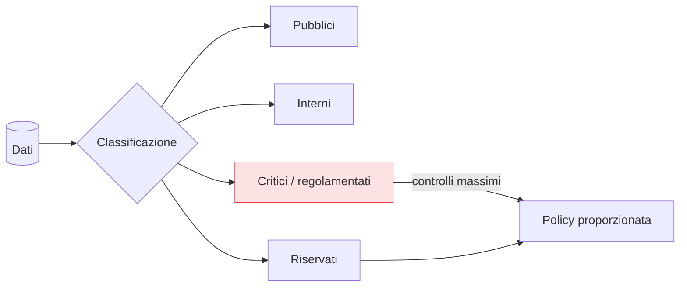

## Perché conta

Tutta la serie — [identità](),
[rete](),
[workload]() — serve un fine: proteggere ciò che
l'attaccante vuole davvero, i **dati**. È l'errore di molti programmi Zero Trust: fermarsi
all'accesso e lasciare i dati in chiaro, accessibili a chiunque superi un controllo. Lo Zero Trust
**data-centric** mette i dati al centro: classificarli, cifrarli, controllarne l'accesso al livello
del dato stesso, e rilevarne la fuga. Perché se i dati sono protetti, una breccia altrove fa molto
meno danno.

## Partire dal dato: classificazione

Non si può proteggere ciò che non si conosce. Il primo passo è **classificare**: quali dati esistono,
dove sono, quanto sono sensibili.



La classificazione guida tutto il resto: i dati critici (dati personali, segreti, finanziari)
meritano cifratura forte, accesso JIT e monitoraggio stretto; i dati pubblici no. Applicare lo stesso
controllo a tutto è spreco dove non serve e insufficienza dove serve.

## Cifratura: a riposo, in transito, e oltre

Lo Zero Trust assume la breccia, quindi i dati vanno cifrati a ogni stadio:

- **In transito**: già coperto da [TLS]() e
  [mTLS]() tra servizi.
- **A riposo**: dischi, database, backup cifrati, così che un furto di storage non riveli nulla.
- **In uso / end-to-end**: dove serve, i dati restano cifrati e leggibili solo da chi ha la chiave,
  non da ogni sistema che li transita.

Il punto Zero Trust è che **la chiave è il vero controllo d'accesso**: chi gestisce le chiavi decide
chi legge. La gestione delle chiavi (KMS, rotazione, separazione dei ruoli) diventa critica quanto
l'IAM.

## Controllo d'accesso al livello del dato

Proteggere la rete e l'applicazione non basta se, una volta dentro, i dati sono un buffet. Lo Zero
Trust porta la [verifica esplicita]() fino al dato:

```text {hl_lines=[2,3]}
# controllo a grana fine, non "ha accesso al DB → vede tutto"
riga:    l'utente vede solo le righe di sua competenza (row-level security)
colonna: i campi sensibili sono mascherati salvo autorizzazione esplicita
```

Row-level security, mascheramento dinamico, tokenizzazione dei campi sensibili: l'accesso al dato è
una decisione per identità e contesto, come ogni altro accesso della serie.

## DLP: rilevare la fuga

La **Data Loss Prevention** sorveglia i dati in movimento verso l'esterno — email, upload, copie — e
blocca o segnala il trasferimento di dati sensibili. È la rete di sicurezza per quando un accesso
legittimo viene abusato (un insider, o un account compromesso che esfiltra). Si lega alla
[telemetria](): un volume anomalo di dati
critici verso l'esterno è un segnale di rischio di primo piano (si pensi al
[DNS tunneling]() come canale di esfiltrazione).

## Perché è il capitolo che conta di più

Gli strati precedenti riducono la **probabilità** di una breccia e il movimento dell'attaccante; lo
Zero Trust sui dati riduce l'**impatto** quando la breccia avviene comunque — ed è l'assunzione di
partenza. Dati classificati, cifrati con chiavi ben gestite e accessibili a grana fine fanno sì che
"sono entrati" non significhi "hanno preso tutto".

## Lab

Con un database e strumenti di base:

1. Cifrate un volume/DB a riposo e verificate che una copia grezza dei file non riveli i dati.
2. Implementate la row-level security su una tabella: due utenti vedono sottoinsiemi diversi delle
   stesse righe.
3. Mascherate una colonna sensibile (es. il numero di carta) salvo per un ruolo autorizzato.
4. Configurate una semplice regola DLP (pattern di dati sensibili in uscita) e osservatela scattare
   su un trasferimento di test.


<details>
<summary><strong>Domanda:</strong> se cifro tutto e metto controlli a grana fine su ogni dato, le applicazioni e le query non diventano ingestibili e lente?</summary>
<p>Il timore è legittimo, e la risposta è: non si cifra e non si controlla "tutto" allo stesso modo —
si fa in proporzione alla <em>classificazione</em>. È il motivo per cui la classificazione è il primo
passo, non un dettaglio burocratico: i dati critici ricevono cifratura forte, chiavi separate e accesso
a grana fine; i dati interni o pubblici ricevono controlli leggeri o nessuno. Applicare i controlli
massimi ovunque è proprio l'errore che rende il sistema lento e odiato, <em>e</em> lascia comunque
scoperti i dati critici se la classificazione non è stata fatta. Sul piano tecnico, molte di queste
protezioni sono ormai economiche e trasparenti: la cifratura a riposo è quasi gratuita sull'hardware
moderno, la row-level security è nativa nei database seri, il mascheramento si applica a livello di
vista. Il costo reale non è prestazionale, è <em>organizzativo</em>: sapere quali dati avete e quanto
valgono. Fatto quel lavoro, i controlli si applicano dove servono e il sistema resta usabile.</p>
</details>


## Conclusione

I dati sono il fine ultimo: proteggere identità e rete serve a proteggere loro. Lo Zero Trust
data-centric li classifica, li cifra a ogni stadio con chiavi che sono il vero controllo d'accesso,
li espone a grana fine e ne sorveglia la fuga con la DLP. È lo strato che riduce l'impatto della
breccia che abbiamo assunto dall'inizio. Abbiamo tutti i pezzi: l'ultimo capitolo li mette insieme
in un percorso di migrazione realistico.
