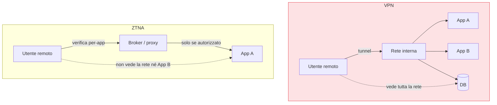

## Perché conta

La VPN è stata il modo di dare accesso remoto per vent'anni, ed è l'anti-pattern perfetto dello Zero
Trust: autentichi una volta all'ingresso e poi sei **dentro la rete**, libero di muoverti — esattamente
il modello [castello-e-fossato]() che vogliamo superare. Lo
**ZTNA (Zero Trust Network Access)** ribalta la logica: non ti dà la rete, ti dà **la singola
applicazione**, e verifica identità e dispositivo a ogni richiesta. È il PEP per l'accesso remoto.

## VPN contro ZTNA

Con la VPN, l'utente remoto ottiene un indirizzo sulla rete interna e può raggiungere qualunque cosa
non sia bloccata. Con lo ZTNA, l'utente raggiunge **solo** l'applicazione per cui è autorizzato, e
le altre risorse per lui **non esistono**: non le vede, non può scansionarle, non può muoversi
lateralmente.

## I componenti

- **Broker / trust engine** (il PDP): verifica identità (dall'[IdP]()),
  postura del [dispositivo]() e contesto, e decide.
- **Connector / gateway** (il PEP): sta davanti all'applicazione e stabilisce la connessione solo
  dopo l'ok del broker. Spesso l'app non è esposta a Internet affatto: è il connector a iniziare la
  connessione in uscita verso il broker.
- **Client** (sull'endpoint) o accesso **clientless** via browser per le app web.

## Due modelli: service-initiated e endpoint-initiated

- **Service-initiated**: il connector accanto all'app apre una connessione in uscita verso il
  broker; l'app non ha porte aperte verso Internet. L'attaccante non può nemmeno **vedere**
  l'applicazione, men che meno attaccarla. È il modello più forte.
- **Endpoint-initiated**: un client sull'endpoint instrada il traffico verso il broker. Più simile a
  una VPN per-app, utile quando non si controlla il lato applicazione.

## La differenza che conta: superficie invisibile

Il vantaggio più sottovalutato dello ZTNA non è la granularità, è l'**invisibilità**. Con il modello
service-initiated le applicazioni non hanno indirizzi pubblici raggiungibili: scompaiono da Internet.
Non si può attaccare ciò che non si può raggiungere. La VPN, al contrario, è essa stessa un servizio
esposto — e le vulnerabilità dei gateway VPN sono tra le porte d'ingresso più sfruttate in assoluto.

## Micro-autorizzazione continua

Lo ZTNA non decide una volta sola. A ogni richiesta (o a intervalli) rivaluta: l'identità è ancora
valida? Il dispositivo è ancora conforme? Il rischio è cambiato? È la
[verifica continua]() applicata
all'accesso remoto. Se la postura del laptop peggiora a metà sessione, l'accesso può restringersi
senza aspettare il prossimo login.

## Lab

Con uno ZTNA open source (es. Pomerium, o un identity-aware proxy davanti a un'app):

1. Mettete un proxy identity-aware davanti a un'app web di test, integrato con un
   [IdP]().
2. Verificate che l'accesso richieda autenticazione **per quell'app**, non un login di rete.
3. Fate in modo che l'app non sia raggiungibile direttamente (solo tramite il proxy) e confermate che
   senza passare dal proxy non risponde.
4. Aggiungete una regola di autorizzazione per gruppo e provate un utente autorizzato e uno no.



<strong>Domanda:</strong> alcune cose (SSH, desktop remoto, app legacy) hanno bisogno di accesso di rete vero, non solo HTTP. Lo ZTNA basta a sostituire la VPN del tutto?

In gran parte sì, ma con onestà sui casi limite. Lo ZTNA non è solo per il web: i broker moderni
gestiscono TCP e UDP arbitrari, quindi SSH, RDP e molte app legacy passano, sempre per-risorsa e non
per-rete. Il vero discrimine non è il protocollo ma la <em>granularità</em>: lo ZTNA dà accesso a "questo
host su questa porta per questa identità", non a un intero segmento. Restano scenari in cui serve
davvero connettività di rete ampia — amministrazione di apparati, protocolli che scoprono peer a
broadcast, alcuni ambienti industriali — dove un tunnel resta la scelta pratica; ma è un tunnel
ristretto e autenticato, non la vecchia VPN che porta sulla rete piatta. L'obiettivo realistico non è
"zero tunnel", è "nessun accesso di rete implicito": ogni rotta, anche di livello 3, nasce da una
decisione per identità, e le eccezioni sono poche, ristrette e monitorate.



## Conclusione

Lo ZTNA sostituisce la VPN capovolgendone il principio: non accesso alla rete ma alla singola
applicazione, verificato a ogni richiesta e, nel modello migliore, con le risorse del tutto
invisibili da Internet. È il PEP dell'accesso remoto. Quando questa logica si fonde con la sicurezza
di rete erogata dal cloud, nasce il SASE: il prossimo capitolo.
